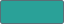
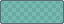

# DeepSeaFoam


**A quiet workstation beneath deep water, with small seafoam-colored signals and warm light illuminating what matters.**

[Explore the live DeepSeaFoam showcase](https://zanark.github.io/DeepSeaFoam/) · [Download the latest release](https://github.com/Zanark/DeepSeaFoam/releases/latest)

DeepSeaFoam is a cross-application dark theme derived from [Ethan Schoonover's Solarized palette](https://ethanschoonover.com/solarized/), but it is not Solarized Dark renamed. Its defining relationship is an extremely dark teal working surface surrounded by slightly lighter blue-green structure:

- **Workspace / recessed surface:** `#000F13`
- **Headers, toolbars, and panels:** `#001E26`
- **Primary interaction accent:** `#2AA198`

The interface should recede behind the work. Cyan is a restrained signal, ivory supplies selective warmth, and errors remain clear exceptions. Application exports do not add ocean decoration, colored glow, gradients, or textures, and never recolor documents, artwork, images, videos, or exported content.

Version **0.2.0** deliberately replaces the original pure-black workspace with near-black teal. This updates the cross-application design without changing the read-only SpriteCanvas origin. Shadow and backdrop overlays retain their transparent black; they are not workspace surfaces.

## The underwater showcase

The logo is seafoam-colored kelp with warm foam bubbles layered in front. One local [SVG](site/mark.svg) supplies the website header, footer, workspace study, favicon and web-app icon.

The [website](https://zanark.github.io/DeepSeaFoam/) is a cinematic interpretation of the theme: a brief surface-crossing descent, refracted light, drifting particles, and strongly swaying layered kelp with out-of-focus foreground fronds. Scrolling releases bubbles from below; clicking or tapping releases a small burst from that exact point. They drift upward without blocking links or controls. Scroll deeper and the light fades.

Three encounters occupy separate levels, with no collapsible cards: a nautilus continuously drifts right-to-left through the upper water after the workspace study; a blobfish peeks through foreground kelp farther down after the palette; and the anglerfish waits in the deepest scene after the application exports. Only its lure is visible until clicked. Its native checkbox also supports keyboard Space and works without JavaScript, without expanding any section.

The ordering is **habitat-inspired, not a literal ecosystem model**. NOAA describes the [nautilus's shell and backward propulsion](https://www.fisheries.noaa.gov/species/chambered-nautilus); UT Marine Science Institute places [blobfish around 2,000-4,000 feet](https://utmsi.utexas.edu/science-and-the-sea/radio-program/blobfish/); MBARI describes [deep-sea anglerfish in the midnight zone](https://www.mbari.org/animal/deep-sea-anglerfish/). Habitats overlap and vary by species. The 0-2,000 m scroll gauge is narrative. Deep kelp is deliberately theatrical foreground: [real kelp needs shallow, sunlit water](https://oceanservice.noaa.gov/facts/kelp.html). The creatures are stylized illustrations, not biological reconstructions.

This scenery belongs **only to the showcase**, not the canonical palette or application exports. Exact-color swatches and interface studies remain unfiltered. Scene artwork and the DeepSeaFoam mark are original local SVG/CSS; application marks are credited third-party assets. There is no video, WebGL, external image service, audio, or runtime dependency. The complete site stays within a **128 KiB asset budget**, raised from 100 KiB to include the requested full-color application SVGs and their license notices without altering the artwork. **Pause motion** freezes animation; reduced-motion preferences skip the descent and keep the nautilus stationary and visible. **Skip descent**, Escape, or scrolling also bypasses the opening. All three encounters remain available without JavaScript.

Pause, reduced motion, hidden tabs and page departure clear transient bubbles. Scroll bursts are frame-coalesced and rate-limited; at most 64 bubbles exist, and completed animations remove themselves. The generated gallery JSON is compact and contains only the core groups it displays; full extension metadata stays in the canonical palette.

The five application cards use locally hosted, lazy-loaded SVGs in their original colors: VS Code and Visual Studio from Devicon, Windows Terminal from Microsoft's repository, Firefox from Browser Logos, and Obsidian from its official brand assets. [Pinned source URLs and checksums](docs/application-icons.json) preserve provenance; [notices and license files](site/icons/NOTICE.txt) accompany the assets. Product marks belong to their respective owners and do not imply endorsement. Obsidian's [brand guidelines](https://obsidian.md/brand) prohibit modifying its mark and require contacting its owner for commercial use.

## Download

Download the current packages from the [latest GitHub release](https://github.com/Zanark/DeepSeaFoam/releases/latest):

| Asset | Intended use |
| --- | --- |
| `DeepSeaFoam-VSCode-<version>.vsix` | Installable Visual Studio Code extension |
| `DeepSeaFoam-Obsidian-<version>.zip` | Obsidian theme folder |
| `DeepSeaFoam-WindowsTerminal-<version>.json` | Windows Terminal scheme object |
| `DeepSeaFoam-VisualStudio-<version>.vstheme` | Visual Studio theme source for Color Theme Designer / VSIX packaging |
| `DeepSeaFoam-Firefox-<version>.zip` | Firefox static-theme source; permanent installation requires Mozilla signing |
| `DeepSeaFoam-<version>.zip` | Complete palette, documentation, generator, and all application exports |
| `SHA256SUMS.txt` | SHA-256 checksums for every release asset |

## Supported applications

| Application | Native format | Scope |
| --- | --- | --- |
| [Visual Studio Code](targets/vscode/README.md) | Color-theme extension | Workbench, editor, syntax, terminal, diagnostics |
| [Visual Studio](targets/visual-studio/README.md) | `.vstheme` | Visual Studio 2022 editor categories plus Visual Studio 2026 semantic shell tokens |
| [Obsidian](targets/obsidian/README.md) | `manifest.json` + `theme.css` | Workspace chrome, editor, reading view, controls, graph |
| [Windows Terminal](targets/windows-terminal/README.md) | Color-scheme JSON | Terminal background, foreground, selection, cursor, ANSI colors |
| [Firefox](targets/firefox/README.md) | Static WebExtension theme | Browser chrome, tabs, fields, popups, sidebar, Firefox new-tab surface |

These are export files, not proof of runtime validation in every application version. Nothing in this repository installs a theme or modifies live application settings.

## Core interface palette

| Swatch | Semantic role | Value |
| --- | --- | --- |
|  | Base / recessed surface | `#000F13` |
|  | Panel surface | `#001E26` |
|  | Primary accent | `#2AA198` |
|  | Primary text | `#93A1A1` |
|  | Secondary / faint text | `#839496` |
|  | Warm emphasis | `#EEE8D5` |
|  | Light selection edge | `#FDF6E3` |
|  | Strong border | `#586E75` |
|  | Document indicator | `#859900` |
|  | Warning indicator | `#B58900` |
|  | Error indicator | `#DC322F` |

## Transparent overlays

The values below use `#RRGGBBAA`, with alpha last. Their swatches are composited over a neutral checkerboard because the displayed color depends on the surface beneath them.

| Swatch | Semantic role | Value |
| --- | --- | --- |
|  | Separators | `#586E7566` |
|  | Hover fills | `#586E7533` |
|  | Soft shadows | `#00000066` |
|  | Strong shadows | `#000000CC` |
|  | Modal backdrop | `#000000B8` |
|  | Pixel grid | `#002B3630` |
|  | Symmetry guide | `#2AA19888` |
|  | Brush cursor | `#FDF6E3AA` |

## Higher-contrast terminals

Version **0.3.0** adds a terminal-only extension inspired by the supplied **Solarized Dark Higher Contrast** scheme: brighter mist text, richer ANSI colors, warm whites, and an orange cursor. Windows Terminal and VS Code's integrated terminal share these exact 19 values. The reference background `#001E27` is deliberately replaced by DeepSeaFoam's `#000F13`; the rest of the reference's terminal colors are preserved.

These are **not additions to the core UI palette**. Editor syntax, application chrome, diagnostic colors and the existing 27 core values remain unchanged.

| Swatch | Terminal role | Value |
| --- | --- | --- |
|  | Foreground | `#9CC2C3` |
|  | Cursor | `#F34B00` |
|  | Selection background | `#003748` |
|  | Black | `#002831` |
|  | Red | `#F54F65` |
|  | Green | `#6CBE6C` |
|  | Yellow | `#EDAE29` |
|  | Blue | `#2176C7` |
|  | Magenta | `#C61C6F` |
|  | Cyan | `#259286` |
|  | White | `#EAE3CB` |
|  | Bright black | `#006488` |
|  | Bright red | `#F5858C` |
|  | Bright green | `#51EF84` |
|  | Bright yellow | `#FFF96E` |
|  | Bright blue | `#178EC8` |
|  | Bright magenta | `#E24D8E` |
|  | Bright cyan | `#00B39E` |
|  | Bright white | `#FCF4DC` |

## Preview-only neutrals

These colors keep image and transparency previews visually neutral. They are not alternate application backgrounds.

| Swatch | Established role | Value |
| --- | --- | --- |
|  | Main checkerboard light square | `#D0D1C9` |
|  | Main checkerboard dark square | `#B2B5AE` |
|  | Navigator preview shade one | `#292E33` |
|  | Navigator preview shade two | `#30363B` |
|  | Comparison preview shade one | `#30373A` |
|  | Comparison preview shade two | `#394143` |
|  | Frame-thumbnail background | `#343B40` |
|  | Layer-thumbnail background | `#191D22` |

## Canonical source and extensions

[`palette/deepseafoam.json`](palette/deepseafoam.json) is the machine-readable source for all exports. The verified core inventory remains **11 interface solids + 8 overlays + 8 preview neutrals = 27 values**.

Code editors and terminals require roles that SpriteCanvas never defined. The canonical source separates the retained Solarized **syntax heritage extension** from the **higher-contrast terminal extension**, rather than redefining the core UI colors. Derived UI text-selection colors are recorded separately.

See [application mappings](docs/MAPPINGS.md) for the exact surface decisions, extension roles, and unsupported boundaries across all five targets.

Run:

```powershell
npm run generate
npm test
npm run package:release
```

`generate` rebuilds the five application exports and all core/terminal SVG swatches. `test` verifies JSON, XML, required theme invariants, contrast pairs, swatch coverage, and generated freshness. `package:release` creates the downloadable files under ignored `dist\`.

## Porting rules

1. Preserve the near-black teal workspace / lighter blue-green panel relationship when the host exposes both surfaces.
2. Map semantic roles rather than similarly named fields.
3. Keep cyan restrained and preserve warm emphasis.
4. Treat text selection, diagnostics, syntax, and ANSI colors as deliberate application-specific mappings.
5. Preserve alpha when supported; otherwise record the background and opaque composite.
6. Keep user content separate from application chrome.
7. Document unsupported surfaces and runtime-validation status honestly.
8. Treat export, installation, and application validation as separate actions.

## Origin and attribution

DeepSeaFoam originated in [SpriteCanvas](https://github.com/Zanark/SpriteCanvas). SpriteCanvas remains the read-only reference for the original surface hierarchy, interaction recipes, overlays, and neutral previews. Its original black workspace is historical provenance, not the current cross-application base.

DeepSeaFoam is derived from [Solarized by Ethan Schoonover](https://ethanschoonover.com/solarized/). The retained heritage colors are identified explicitly in the canonical palette rather than silently restoring the full Solarized theme.
