# DeepSeaFoam


**A quiet workstation beneath deep water, with small seafoam-colored signals and warm light illuminating what matters.**

[Explore the live DeepSeaFoam showcase](https://zanark.github.io/DeepSeaFoam/) · [Download the latest release](https://github.com/Zanark/DeepSeaFoam/releases/latest)

DeepSeaFoam is a cross-application dark theme derived from [Ethan Schoonover's Solarized palette](https://ethanschoonover.com/solarized/), but it is not Solarized Dark renamed. Its defining relationship is an extremely dark teal working surface surrounded by slightly lighter blue-green structure:

- **Workspace / recessed surface:** `#000F13`
- **Headers, toolbars, and panels:** `#001E26`
- **Primary interaction accent:** `#00A591`

The interface should recede behind the work. Cyan is a restrained signal, ivory supplies selective warmth, and errors remain clear exceptions. Application exports do not add ocean decoration, colored glow, gradients, or textures, and never recolor documents, artwork, images, videos, or exported content.

Version **0.2.0** deliberately replaces the original pure-black workspace with near-black teal. This updates the cross-application design without changing the read-only SpriteCanvas origin. Shadow and backdrop overlays retain their transparent black; they are not workspace surfaces.

Version [**0.4.0**](docs/releases/v0.4.0.md) introduced pastel signals; [**0.4.1**](docs/releases/v0.4.1.md) made them richer. **0.4.2 takes its core signals directly from the approved higher-contrast terminal colors, shaded a little darker and richer**: vivid seafoam, green, bright yellow, and rose, not pale or chalky pastels. Focus, document indicators, diagnostics, and core-backed syntax inherit these signals; selection and error fills retain their readability adaptations. Dark surfaces, neutral colors, and the actual terminal scheme remain unchanged. See the [0.4.2 release notes](docs/releases/v0.4.2.md).

Version **0.5.0** expands the collection to **twelve application targets**, adding Discord, Telegram Desktop, Slack, Chrome/Edge, JetBrains IDEs, Sublime Text and Alacritty without changing the palette. Discord is explicitly unofficial custom CSS; Slack exposes only a limited native color preset. See the [0.5.0 release notes](docs/releases/v0.5.0.md) and each application's installation and restoration guide.

## The underwater showcase

The [website](https://zanark.github.io/DeepSeaFoam/) interprets the theme as a quiet underwater workstation. Its hero opens without an eyebrow, with a short four-line poem and a document-green (`#45D072`) **Find your app** link beside **Explore the palette**. Application exports follow the palette immediately; the interaction study remains below them. The former four principle cards, signal legend, and heritage/extension section are removed from the page, not from the theme's documented mappings.

The shared seaweed-and-foam [mark](site/mark.svg) now has **18 lower-half bubbles and five reflection strokes**, painted in front of the fronds. Header, footer, workspace study, favicon, and web-app icon reuse it; website icon references use the `seaweed-foam-cluster` cache key.

A brief, skippable descent leads into refracted light, drifting particles, and swaying kelp. Ten background clusters and two lens-close edge clusters reuse the local kelp SVG behind the reading area. Scrolling releases bubbles below the visible viewport; pressing or tapping releases them immediately at the pointer, without duplicate compatibility-click bursts. Mouse/pen movement and single-finger swipes drive a bounded Canvas2D wave field; phone taps create a small water displacement that propagates through the same simulation. Passive touch listeners preserve native scrolling and pinch zoom, including when the browser cancels pointer events to begin a pan. This is a stylized effect, not a fluid-accuracy claim; it does not warp text or exact-color studies.

The nautilus roams across a fixed **background scene layer**, moving left, right, up, down and diagonally, independently of page scrolling. It remains above the ocean scenery but below all readable page content, so its full-viewport freedom never paints over text. Its seeded model chooses 4–10-second legs with **30–84 CSS-pixel/s target speeds, three times the previous targets**, smooth damping and soft confinement; turns can repeat a direction. Actual screen speed eases near the edges rather than wrapping or teleporting. It follows the visible viewport during phone zoom, never intercepts clicks or touches, and parks near the lower-right without JavaScript or with reduced motion. Pause preserves its current pose; the intro, hidden pages and loss of focus suspend movement.

The click-only anglerfish follows the interaction study. The **blobfish now lives at the bottom of the footer**, behind a separate twenty-cluster kelp hideout. Its native reveal parts the foliage outward; click/tap or keyboard Space reveals and retracts either creature without JavaScript or expanding their sections. This order and the 0–2,000 m gauge are theatrical composition, **not a biological depth-order claim**.

The blobfish is a **user-supplied transparent illustration**, cleaned of isolated specks, cropped, and resized to a 640×345 WebP. The fish has no CSS opacity reduction or filter; its painted colors are not dimmed for concealment. Its original artist and license were not supplied; no blanket project license is asserted. [Processing metadata](docs/showcase-artwork.json), the optional [Pillow preparation script](scripts/prepare-blobfish.py), and the [artwork notice](site/artwork-NOTICE.txt) document that boundary. The private source image is not distributed with the repository.

Scenery belongs **only to the showcase**, not the application exports. The complete site has a **256 KiB asset cap**, increased from 200 KiB for the expanded application marks and their license notices; every deployed file still counts. There is no video, WebGL, audio, external image service, or runtime library dependency. The photographic inspiration is an external link, not an automatically loaded image. **Pause motion** freezes scenery and clears transient wakes; reduced motion skips the descent. **Skip descent**, Escape, Tab, navigation, or scrolling also bypasses the opening. Without JavaScript, the page and native creature reveals remain usable; the dynamic palette instead links to the README swatches.

The design essay distinguishes Solarized's designer rationale, maritime night-lookout guidance, a 2013 display-polarity study's abstract, and WCAG contrast guidance. None tests DeepSeaFoam or establishes universal comfort or eye-health benefits. See the [showcase architecture, motion lifecycle, artwork pipeline, and evidence limits](docs/SHOWCASE.md).

The twelve application cards use locally hosted, lazy-loaded SVGs in their original colors, sourced from Devicon, SVG Logos, Browser Logos, and the Windows Terminal, Alacritty and Obsidian projects. [Pinned source URLs and checksums](docs/application-icons.json) preserve provenance; [notices and license files](site/icons/NOTICE.txt) accompany the assets. Product marks belong to their respective owners and do not imply endorsement. Obsidian's [brand guidelines](https://obsidian.md/brand) prohibit modifying its mark and require contacting its owner for commercial use.

## Download

Download the current packages from the [latest GitHub release](https://github.com/Zanark/DeepSeaFoam/releases/latest):

| Asset | Intended use |
| --- | --- |
| `DeepSeaFoam-VSCode-<version>.vsix` | Installable Visual Studio Code extension |
| `DeepSeaFoam-Obsidian-<version>.zip` | Obsidian theme folder |
| `DeepSeaFoam-WindowsTerminal-<version>.json` | Windows Terminal scheme object |
| `DeepSeaFoam-VisualStudio-<version>.vstheme` | Visual Studio theme source for Color Theme Designer / VSIX packaging |
| `DeepSeaFoam-Firefox-<version>.zip` | Firefox static-theme source; permanent installation requires Mozilla signing |
| `DeepSeaFoam-Discord-<version>.theme.css` | Optional unofficial CSS for already-modified Discord clients |
| `DeepSeaFoam-TelegramDesktop-<version>.tdesktop-theme` | Native colors-only Telegram Desktop theme |
| `DeepSeaFoam-Slack-<version>.txt` | Four-color string for Slack's native custom-theme controls |
| `DeepSeaFoam-Chromium-<version>.zip` | Extractable Chrome/Edge theme source for Load unpacked |
| `DeepSeaFoam-JetBrains-<version>.jar` | Resource-only theme plugin for JetBrains 2025.3+ |
| `DeepSeaFoam-SublimeText-<version>.sublime-color-scheme` | Sublime Text 4 editor/syntax color scheme |
| `DeepSeaFoam-Alacritty-<version>.toml` | Colors-only fragment imported into an existing Alacritty config |
| `DeepSeaFoam-<version>.zip` | Complete palette, documentation, generator, and all application exports |
| `SHA256SUMS.txt` | SHA-256 checksums for every release asset |

The showcase on `main` and GitHub Pages can advance independently of immutable source bundles. Website-only refinements do not require a palette version bump or replacement artifacts; **0.5.0 is a new release for the additional application exports**, leaving all earlier assets untouched.

## Supported applications

| Application | Export format | Scope |
| --- | --- | --- |
| [Visual Studio Code](targets/vscode/README.md) | Color-theme extension | Workbench, editor, syntax, terminal, diagnostics |
| [Visual Studio](targets/visual-studio/README.md) | `.vstheme` | Visual Studio 2022 editor categories plus Visual Studio 2026 semantic shell tokens |
| [Obsidian](targets/obsidian/README.md) | `manifest.json` + `theme.css` | Workspace chrome, editor, reading view, controls, graph |
| [Windows Terminal](targets/windows-terminal/README.md) | Color-scheme JSON | Terminal background, foreground, selection, cursor, ANSI colors |
| [Firefox](targets/firefox/README.md) | Static WebExtension theme | Browser chrome, tabs, fields, popups, sidebar, Firefox new-tab surface |
| [Discord](targets/discord/README.md) | `.theme.css` (unofficial) | Optional CSS for modified desktop clients; not a native Discord importer |
| [Telegram Desktop](targets/telegram/README.md) | `.tdesktop-theme` | Desktop navigation, chat/message surfaces, text and controls |
| [Slack](targets/slack/README.md) | Native custom-color preset | Only Slack's exposed theme controls, not a whole-client CSS replacement |
| [Chrome / Edge](targets/chromium/README.md) | Chromium theme manifest | Browser-owned chrome; no website injection or permissions |
| [JetBrains IDEs](targets/jetbrains/README.md) | Theme-only plugin | IDE chrome plus editor color scheme |
| [Sublime Text](targets/sublime-text/README.md) | `.sublime-color-scheme` | Editor and syntax; pair with the built-in Adaptive UI |
| [Alacritty](targets/alacritty/README.md) | TOML color fragment | Terminal, selection, cursor and the same higher-contrast ANSI palette |

These are export files, not proof of runtime validation in every application version. Nothing in this repository installs a theme or modifies live application settings.

## Core interface palette

| Swatch | Semantic role | Value |
| --- | --- | --- |
| 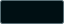 | Base / recessed surface | `#000F13` |
| 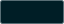 | Panel surface | `#001E26` |
| 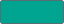 | Primary accent | `#00A591` |
| 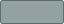 | Primary text | `#93A1A1` |
| 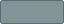 | Secondary / faint text | `#839496` |
| 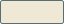 | Warm emphasis | `#EEE8D5` |
|  | Light selection edge | `#FDF6E3` |
|  | Strong border | `#586E75` |
| 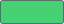 | Document indicator | `#45D072` |
| 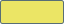 | Warning indicator | `#EBE565` |
|  | Error indicator | `#E84A5F` |

## Transparent overlays

The values below use `#RRGGBBAA`, with alpha last. Their swatches are composited over a neutral checkerboard because the displayed color depends on the surface beneath them.

| Swatch | Semantic role | Value |
| --- | --- | --- |
| 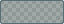 | Separators | `#586E7566` |
| 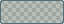 | Hover fills | `#586E7533` |
| 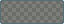 | Soft shadows | `#00000066` |
| 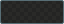 | Strong shadows | `#000000CC` |
| 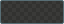 | Modal backdrop | `#000000B8` |
| 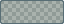 | Pixel grid | `#002B3630` |
| 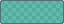 | Symmetry guide | `#00A59188` |
| 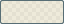 | Brush cursor | `#FDF6E3AA` |

## Higher-contrast terminals

Version **0.3.0** introduced a terminal-only extension inspired by the supplied **Solarized Dark Higher Contrast** scheme: brighter mist text, richer ANSI colors, warm whites, and an orange cursor. Windows Terminal, VS Code's integrated terminal and the new Alacritty export share these exact 19 values. The reference background `#001E27` is deliberately replaced by DeepSeaFoam's `#000F13`; the rest of the reference's terminal colors are preserved.

This terminal group remains **separate from the 27-value core UI palette**. Its 0.3.0 introduction left editor syntax, application chrome, diagnostics, and the core unchanged. Version 0.4.2 derives four core signals from selected terminal entries without changing the source group. **0.5.0 preserves all 19 colors and extends that same scheme to Alacritty**, mapping `purple` to its native `magenta` key.

| Swatch | Terminal role | Value |
| --- | --- | --- |
| 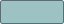 | Foreground | `#9CC2C3` |
|  | Cursor | `#F34B00` |
| 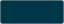 | Selection background | `#003748` |
| 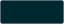 | Black | `#002831` |
| 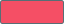 | Red | `#F54F65` |
| 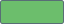 | Green | `#6CBE6C` |
|  | Yellow | `#EDAE29` |
|  | Blue | `#2176C7` |
|  | Magenta | `#C61C6F` |
| 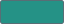 | Cyan | `#259286` |
| 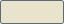 | White | `#EAE3CB` |
|  | Bright black | `#006488` |
| 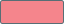 | Bright red | `#F5858C` |
| 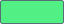 | Bright green | `#51EF84` |
| 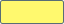 | Bright yellow | `#FFF96E` |
|  | Bright blue | `#178EC8` |
| 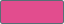 | Bright magenta | `#E24D8E` |
| 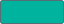 | Bright cyan | `#00B39E` |
|  | Bright white | `#FCF4DC` |

## Preview-only neutrals

These colors keep image and transparency previews visually neutral. They are not alternate application backgrounds.

| Swatch | Established role | Value |
| --- | --- | --- |
| 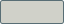 | Main checkerboard light square | `#D0D1C9` |
| 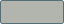 | Main checkerboard dark square | `#B2B5AE` |
| 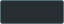 | Navigator preview shade one | `#292E33` |
| 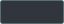 | Navigator preview shade two | `#30363B` |
| 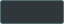 | Comparison preview shade one | `#30373A` |
| 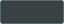 | Comparison preview shade two | `#394143` |
| 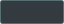 | Frame-thumbnail background | `#343B40` |
| 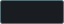 | Layer-thumbnail background | `#191D22` |

## Canonical source and extensions

[`palette/deepseafoam.json`](palette/deepseafoam.json) is the machine-readable source for all exports. The verified core inventory remains **11 interface solids + 8 overlays + 8 preview neutrals = 27 values**.

Code editors and terminals require roles that SpriteCanvas never defined. The canonical source separates the retained Solarized **syntax heritage extension** from the **higher-contrast terminal extension**. The four heritage syntax colors stay unchanged in 0.4.2, while strings, keywords, numbers, and diagnostics mapped from the core inherit the vivid terminal-derived signals. `signalAdaptation` records each terminal source and its proportional shade scale; derived UI selection/error colors are recorded separately.

See [application mappings](docs/MAPPINGS.md) for the surface decisions, extension roles, source references and unsupported boundaries across all twelve targets.

Run:

```powershell
npm run generate
npm test
npm run package:release
```

`generate` rebuilds the application exports and all core/terminal SVG swatches. `test` checks theme invariants, contrast pairs, swatches, generated freshness, the export and site contracts, and scene controllers including nautilus drift. `package:release` creates the downloadable files under ignored `dist\`.

## Porting rules

1. Preserve the near-black teal workspace / lighter blue-green panel relationship when the host exposes both surfaces.
2. Map semantic roles rather than similarly named fields.
3. Keep cyan restrained and preserve warm emphasis.
4. Treat text selection, diagnostics, syntax, and ANSI colors as deliberate application-specific mappings.
5. Preserve alpha when supported; otherwise record the background and opaque composite.
6. Keep user content separate from application chrome.
7. Document unsupported surfaces and runtime-validation status honestly.
8. Treat export, installation, and application validation as separate actions.

## Origin and attribution

DeepSeaFoam originated in [SpriteCanvas](https://github.com/Zanark/SpriteCanvas). SpriteCanvas remains the read-only reference for the original surface hierarchy, interaction recipes, overlays, and neutral previews. Its original black workspace and signal colors are historical provenance; the 0.2.0 base and later signal revisions do not alter that origin.

DeepSeaFoam is derived from [Solarized by Ethan Schoonover](https://ethanschoonover.com/solarized/). The retained heritage colors are identified explicitly in the canonical palette rather than silently restoring the full Solarized theme.

The project's photographic inspiration is [**Bay with Orange Seashore Under White and Gray Clouds**](https://www.pexels.com/photo/bay-with-orange-seashore-under-white-and-gray-clouds-8567869/) by [**JJ Perks**](https://www.pexels.com/@jj-perks-868548/) on Pexels. Its [full-resolution original](https://images.pexels.com/photos/8567869/pexels-photo-8567869.jpeg) is **7952 x 5304 pixels**, as listed in Pexels' image metadata. The website credits and links to it without bundling or automatically loading the large photograph. This is a visual reference, not a claim that the palette was sampled from its pixels. [Reference metadata](docs/showcase-artwork.json) preserves the source and [Pexels License](https://www.pexels.com/license/) link.
