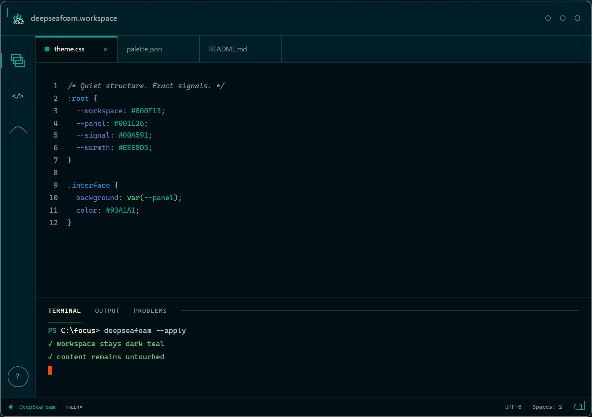
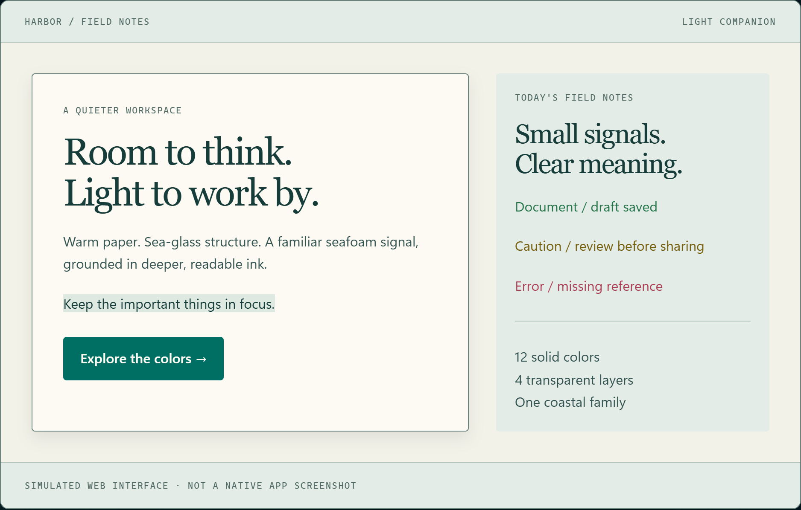

  

  

  <a href="https://zanark.github.io/DeepSeaFoam/">Website</a> &nbsp; · &nbsp;
  <a href="docs/GUIDE.md#install">Install / guide</a> &nbsp; · &nbsp;
  <a href="docs/PALETTE.md">Full palette</a> &nbsp; · &nbsp;
  <a href="https://github.com/Zanark/DeepSeaFoam/releases/latest">Releases</a>

## DeepSeaFoam · dark

| Role | Color |
| :--- | :--- |
| Workspace |  `#000F13` |
| Panel |  `#001E26` |
| Text |  `#93A1A1` |
| Secondary text |  `#839496` |
| Warm emphasis |  `#EEE8D5` |
| Light selection edge |  `#FDF6E3` |
| Border |  `#586E75` |
| Accent |  `#00A591` |
| Document indicator |  `#45D072` |
| Warning |  `#EBE565` |
| Error |  `#E84A5F` |

## Harbor Daylight · light

An adopted light companion; [web study, not 21 light app ports](docs/HARBOR-DAYLIGHT.md).

| Role | Color |
| :--- | :--- |
| Background |  `#F3F2E9` |
| Surface |  `#E3ECE7` |
| Paper / button text |  `#FCFAF2` |
| Text |  `#355451` |
| Muted text |  `#536B66` |
| Heading |  `#173D3A` |
| Border |  `#6B857E` |
| Accent |  `#006F63` |
| Accent hover |  `#00594F` |
| Document indicator |  `#247449` |
| Warning |  `#77600E` |
| Error |  `#AD3E55` |

## In practice

Browser captures of **simulated HTML/CSS interface studies**, not native-app screenshots or validation.

**DeepSeaFoam · workspace**

**Harbor Daylight · light companion**

<a href="docs/GUIDE.md#origin-attribution-and-rights">Origin, attribution &amp; rights</a>

