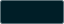

# DeepSeaFoam guide

[Visual overview](../README.md) · [Full palette](PALETTE.md) · [Application mappings](MAPPINGS.md) · [Showcase architecture](SHOWCASE.md) · [Publishing](PUBLISHING.md)

## Overview

A quiet workstation beneath deep water, with small seafoam-colored signals and warm light illuminating what matters. DeepSeaFoam is derived from [Ethan Schoonover's Solarized palette](https://ethanschoonover.com/solarized/), but it is not Solarized Dark renamed. Its defining relationship is an extremely dark teal workspace ( `#000F13`) surrounded by slightly lighter blue-green structure ( `#001E26`), with restrained seafoam interaction signals ( `#00A591`) and selective warm emphasis.

Application exports keep working surfaces flat: no ocean decoration, colored glow, gradients or textures, and no recoloring of documents, artwork, images, videos or exported content. The cinematic scenery belongs only to the website.

[Harbor Daylight](HARBOR-DAYLIGHT.md) is now an adopted light companion: warm ivory, sea-glass surfaces and deep tidal ink. It has a separate canonical palette and a website interface study. **The existing 21 dark application targets are unchanged; this adoption does not provide 21 light ports.** The README previews are real browser captures of simulated HTML/CSS studies, not native-application screenshots or runtime validation.

## Install

**VS Code:** [Install from the Visual Studio Marketplace](https://marketplace.visualstudio.com/items?itemName=zanark.deepseafoam-theme).

For another application, use its installation **and restoration** guide below. Download available packages from the [latest GitHub release](https://github.com/Zanark/DeepSeaFoam/releases/latest), or build the current **0.7.0** source locally with `npm run package:release`. A source version and an available remote release are separate states; local packaging does not publish anything.

### Application guides

| Application | Export format | Scope |
| --- | --- | --- |
| [Visual Studio Code](../targets/vscode/README.md) | Color-theme extension | Workbench, editor, syntax, terminal, diagnostics |
| [Visual Studio](../targets/visual-studio/README.md) | `.vstheme` | Visual Studio 2022 editor categories plus Visual Studio 2026 semantic shell tokens |
| [Obsidian](../targets/obsidian/README.md) | `manifest.json` + `theme.css` | Workspace chrome, editor, reading view, controls, graph |
| [Windows Terminal](../targets/windows-terminal/README.md) | Color-scheme JSON | Terminal background, foreground, selection, cursor, ANSI colors |
| [Firefox](../targets/firefox/README.md) | Static WebExtension theme | Browser chrome, tabs, fields, popups, sidebar, Firefox new-tab surface |
| [Discord / BetterDiscord](../targets/discord/README.md) | `.theme.css` (unofficial) | BetterDiscord or Vencord CSS; not a stock Discord importer |
| [Telegram Desktop](../targets/telegram/README.md) | `.tdesktop-theme` | Desktop navigation, chat/message surfaces, text and controls |
| [Slack](../targets/slack/README.md) | Native custom-color preset | Only Slack's exposed theme controls, not a whole-client CSS replacement |
| [Chrome / Edge](../targets/chromium/README.md) | Chromium theme manifest | Browser-owned chrome; no website injection or permissions |
| [JetBrains IDEs](../targets/jetbrains/README.md) | Theme-only plugin | IDE chrome plus editor color scheme; JetBrains 2025.3+ |
| [Sublime Text](../targets/sublime-text/README.md) | `.sublime-color-scheme` | Editor and syntax; pair with the built-in Adaptive UI |
| [Alacritty](../targets/alacritty/README.md) | TOML color fragment | Terminal, selection, cursor and the same higher-contrast ANSI palette |
| [Monkeytype](../targets/monkeytype/README.md) | Native custom-theme share URL + JSON payload | Ten native color slots; no full-settings import, background or custom CSS replacement |
| [Notepad++](../targets/notepad-plus-plus/README.md) | Native XML | Editor, 22 language lexers plus search results; chrome is separate |
| [Zsh](../targets/zsh/README.md) | `.zsh-theme` | Prompt only; plain Zsh and optional Oh My Zsh |
| [rofi](../targets/rofi/README.md) | `.rasi` | Default layout, text and normal/active/urgent selection states |
| [Xfce4 Terminal](../targets/xfce4-terminal/README.md) | `[Scheme]` preset | Shared terminal/ANSI colors; not GTK chrome |
| [Termux](../targets/termux/README.md) | `colors.properties` | Background, foreground, cursor and 16 ANSI colors; no selection key |
| [GitHub Pages](../targets/github-pages/README.md) | HTML/CSS plus optional Jekyll layout | Your hosted site, not github.com or a remote-theme registration |
| [Godot Engine](../targets/godot/README.md) | `.tet` | Built-in script editor; optional manual chrome, not game assets |
| [Nova Launcher](../targets/nova-launcher/README.md) | **Manual** text/background/accent recipe | Version-dependent Android launcher controls; no backup or icon pack |

These are export files, not proof of runtime validation in every application version. Nothing in this repository installs a theme or modifies live application settings. BetterDiscord reuses the Discord theme; its named download is byte-identical, not another target. Modified Discord clients are unofficial and carry terms/account risk.

### Package reference

| Asset | Intended use |
| --- | --- |
| `DeepSeaFoam-VSCode-<version>.vsix` | Installable Visual Studio Code extension |
| `DeepSeaFoam-Obsidian-<version>.zip` | Obsidian theme folder |
| `DeepSeaFoam-WindowsTerminal-<version>.json` | Windows Terminal scheme object |
| `DeepSeaFoam-VisualStudio-<version>.vstheme` | Theme source for version-specific Color Theme Designer / VSIX packaging |
| `DeepSeaFoam-Firefox-<version>.zip` | Static-theme source; permanent installation requires Mozilla signing |
| `DeepSeaFoam-Discord-<version>.theme.css` | Optional unofficial CSS for already-modified Discord clients |
| `DeepSeaFoam-BetterDiscord-<version>.theme.css` | Byte-identical Discord alias; install one, not both |
| `DeepSeaFoam-TelegramDesktop-<version>.tdesktop-theme` | Native colors-only Telegram Desktop theme |
| `DeepSeaFoam-Slack-<version>.txt` | Four-color string for Slack's native custom-theme controls |
| `DeepSeaFoam-Chromium-<version>.zip` | Extractable Chrome/Edge theme source for Load unpacked |
| `DeepSeaFoam-JetBrains-<version>.jar` | Resource-only theme plugin for JetBrains 2025.3+ |
| `DeepSeaFoam-SublimeText-<version>.sublime-color-scheme` | Sublime Text 4 editor/syntax color scheme |
| `DeepSeaFoam-Alacritty-<version>.toml` | Colors-only fragment imported into an existing Alacritty config |
| `DeepSeaFoam-Monkeytype-<version>.zip` | Native colors-only share payload, URL, install/restore guide and MIT license |
| `DeepSeaFoam-NotepadPlusPlus-<version>.xml` | Native Style Configurator theme |
| `DeepSeaFoam-Zsh-<version>.zip` | Dependency-free prompt, install/restore guide and license |
| `DeepSeaFoam-Rofi-<version>.rasi` | Native Rasi theme based on the default layout |
| `DeepSeaFoam-Xfce4Terminal-<version>.theme` | Native terminal color preset |
| `DeepSeaFoam-Termux-<version>.zip` | Native `colors.properties`, guide and license |
| `DeepSeaFoam-GitHubPages-<version>.zip` | Static HTML/CSS starter, optional Jekyll layout and guide |
| `DeepSeaFoam-Godot-<version>.tet` | Native script-editor syntax theme; not a game Theme resource |
| `DeepSeaFoam-NovaLauncher-<version>.zip` | **Manual** color reference and guide; not a Nova backup/import file |
| `DeepSeaFoam-<version>.zip` | Complete palette, documentation, generator and application exports |
| `DeepSeaFoam-Themes-LICENSE.txt` | MIT license for original theme files; retain with redistributed single-file exports |
| `SHA256SUMS.txt` | SHA-256 checksums for every release asset |

Published releases remain immutable. The showcase on `main` and GitHub Pages can advance independently of source bundles; website-only refinements do not require replacing native releases. Version 0.7.0 adds native exports, not new dark colors. Earlier releases and historical Instagram deliverables are separate artifacts.

Marketplace submission, approval and GitHub release availability are also distinct. Monkeytype's [built-in preset PR #8421](https://github.com/monkeytypegame/monkeytype/pull/8421) is separate from its downloadable native share link; a ready export does not establish upstream acceptance. See [publication routes and recorded status](PUBLISHING.md), rather than assuming every application has an approved listing.

## Palette and development

The [full palette reference](PALETTE.md) contains visible swatches and copyable values for dark solids, transparent overlays, preview neutrals, syntax heritage, terminal colors and Harbor Daylight. Dark preview neutrals support checkerboards, comparison wells and thumbnails; they are **not** alternate application backgrounds or the light companion.

[`palette/deepseafoam.json`](../palette/deepseafoam.json) remains the canonical source for dark application exports. Its core inventory is **11 interface solids + 8 overlays + 8 preview neutrals = 27 values**. The four retained Solarized syntax-heritage colors and the higher-contrast terminal extension are separate groups. [`palette/harbor-daylight.json`](../palette/harbor-daylight.json) records the adopted **12-solid + 4-overlay** light companion without rewriting the dark source.

The terminal extension was inspired by the supplied **Solarized Dark Higher Contrast** scheme: brighter mist text, richer ANSI colors, warm whites and an orange cursor. DeepSeaFoam deliberately replaces the reference background  `#001E27` with  `#000F13`, preserving its other 19 terminal values. Terminal exports share that scheme where their native format supports the roles; host omissions are documented in the guides. In Alacritty, `purple` maps to native `magenta`.

The four terminal-derived core signals use recorded `signalAdaptation` shade scales; UI selection and error adaptations are recorded separately. Core-backed strings, keywords, numbers and diagnostics inherit those vivid signals. The heritage syntax colors do not silently restore the full Solarized palette. See [semantic mappings across all 21 targets](MAPPINGS.md) for host surfaces, extensions, references and unsupported boundaries.

Run from the repository root:

```powershell
npm run generate
npm test
npm run package:release
```

`generate` rebuilds application exports, palette references and local swatches; do not hand-edit generated outputs. It also pairs every Markdown color mention with a visible swatch, including prose, composites and historical release notes. `test` checks this coverage, generated freshness, theme invariants, contrast pairs, export/site contracts and scene controllers. `package:release` recreates **only** `dist\releases\<version>\` (currently `dist\releases\0.7.0\`), preserving sibling releases and unrelated `dist\instagram\` / historical deliverables. Its manual VS Code kit is under that version's `marketplace\vscode\` folder. Packaging does not upload, publish or replace remote assets. Commands are defined in [package.json](../package.json#L6-L9); the version-local output boundary is enforced in [package-release.ps1](../scripts/package-release.ps1#L6-L24).

Swatches sit beside the copyable values, not in a remote image service. Existing
palette SVGs are reused; derived and historical values get generated
`docs/color-swatches` assets. Target guides keep local `swatches` PNGs so source
and ZIP guides work offline. VS Code packaging rewrites its README image URLs to
the public `targets/vscode` directory; PNGs satisfy its SVG restrictions.
Transparent colors use a neutral checkerboard, not an assumed application
background or a contrast guarantee. Explicit ARGB examples keep their native
notation while showing the equivalent RGBA color. Fenced examples and Mermaid
source remain intact, with a color key immediately below each example.
The scan covers maintained Markdown throughout the repository, excluding private
`.agent-context`, dependencies, Git internals and immutable `dist` deliveries.

Author website styles in [`scripts/templates/showcase.css`](../scripts/templates/showcase.css);
generation removes indentation and blank lines into `site/styles.css` to retain the
existing asset budgets. [Reusable light tokens and selection rules](../palette/harbor-daylight.css)
are also generated, scoped to `.harbor-daylight`; see the [usage contract](HARBOR-DAYLIGHT.md).

### Porting rules

1. Preserve the dark workspace / lighter blue-green panel relationship when the host exposes both surfaces.
2. Map semantic roles rather than similarly named fields; keep daylight paper, headings and dark warm emphasis distinct.
3. Keep seafoam restrained and preserve selective warm emphasis.
4. Treat text selection, diagnostics, syntax and ANSI colors as deliberate application-specific mappings.
5. Preserve alpha when supported; otherwise record the underlying background and opaque composite. Eight-digit CSS hex is alpha-last, `#RRGGBBAA`.
6. Keep user content separate from application chrome.
7. Document unsupported surfaces and runtime-validation status honestly.
8. Treat export, package validation, installation, runtime validation and publication as separate actions.
9. Follow [Harbor Daylight's selection, hover and filled-action safeguards](HARBOR-DAYLIGHT.md#interaction-safeguards) rather than applying dark ink or translucent overlays indiscriminately.

### Design history

- **0.2.0:** the original pure-black workspace became near-black teal. Transparent-black shadows and backdrops stayed distinct; SpriteCanvas was not changed.
- **0.3.0:** introduced the separate higher-contrast terminal extension without changing editor syntax or the core palette.
- [**0.4.0**](releases/v0.4.0.md) introduced pastel signals; [**0.4.1**](releases/v0.4.1.md) made them richer. [**0.4.2**](releases/v0.4.2.md) replaced those pastels with slightly darker, richer shades of the approved vivid terminal signals. Dark surfaces, neutrals and the terminal source group stayed unchanged.
- [**0.5.0**](releases/v0.5.0.md) expanded to twelve targets. **0.5.1** packaged the scoped theme/code MIT license without changing colors or replacing existing releases.
- [**0.6.0**](releases/v0.6.0.md) added Monkeytype as the thirteenth target, with a colors-only share link that preserves unrelated settings.
- [**0.7.0**](releases/v0.7.0.md) expanded to **21 targets**, adding Notepad++, Zsh, rofi, Xfce4 Terminal, Termux, GitHub Pages, Godot and the manual Nova Launcher recipe. BetterDiscord's explicit alias does not duplicate the palette.
- **Harbor Daylight adoption:** a separate light reference and website study, not a new set of native ports or a publication claim.

## The underwater showcase

The [website](https://zanark.github.io/DeepSeaFoam/) interprets the theme as a quiet underwater workstation. Its hero combines the tagline with a short four-line poem, **Find your app** and **Explore the palette**. Application exports follow the palette; the interaction study remains below them. The retired principle cards, signal legend and heritage section remain documented through the [mappings](MAPPINGS.md), not restored as extra page furniture.

The shared [seaweed-and-foam mark](../site/mark.svg) has 18 lower-half bubbles and five reflection strokes, painted in front of the fronds. Header, footer, workspace study, favicon and web-app icon reuse it. The README's [typographic banner](readme-banner.svg) is a passive, local SVG with system-font fallbacks, no scripts, animation, remote fonts or image services.

A brief, skippable descent leads into refracted light, drifting particles and swaying kelp. Ten background clusters and two softly blurred foreground edge clusters reuse a local SVG. The foreground is cropped to narrow side gutters with control clearance, not laid over text; mobile footer credits share the reading inset. Scroll bubbles start below the visible viewport, while pointer presses and taps emit immediately without duplicate compatibility-click bursts.

Mouse/pen movement and single-finger swipes drive a bounded Canvas2D wave field; taps create a small displacement through the same simulation. Passive touch listeners preserve native scrolling and pinch zoom, including after the browser cancels pointer events to begin a pan. This is a stylized effect, not a fluid-accuracy claim, and it never warps text or exact-color studies.

The nautilus roams independently of page scrolling in a fixed **background scene layer**, above scenery but below readable content. Its seeded model chooses 4–10-second legs with 30–84 CSS-pixel/s target speeds, smooth damping and soft confinement; those targets are three times the earlier values, not a promise of constant measured speed. It never wraps or teleports, follows the visible viewport during zoom and does not intercept input. Without JavaScript or with reduced motion it parks near the lower-right. Pause preserves its pose; the intro, hidden pages and loss of focus suspend movement.

The click-only angler follows the interaction study. The supplied blobfish sits at the bottom of the footer behind twenty kelp clusters; its native reveal parts the foliage. Click/tap or keyboard Space reveals and retracts either creature without JavaScript or expanding its section. Their order and the 0–2,000 m depth gauge are theatrical composition, **not a biological depth-order claim**.

### Music, motion and fallbacks

The supplied **2:56 music** is a **2,817,068-byte MP3**, rather than the 33.8 MB WAV. On eligible fresh visible loads it preloads during the descent and attempts audible playback after the dive completes. Skipped, deep-linked and reduced-motion openings can finish immediately. Browser autoplay policy still applies: a blocked request waits for the first scroll gesture, tap, click or key press. Wheel/trackpad input and single-finger swipes share one scroll attempt, not repeated retries every frame; scripted movement does not trigger it. Some browsers still require a tap, click or key. **Scrolling is not a policy bypass or a guarantee of sound.**

**Cancel music** cancels queued/loading playback. **Pause music** preserves position and prevents later gestures from restarting it. Hiding/leaving the page and history restoration suppress automatic retries; a fresh load or reload can become eligible again. Playback loops at 35% element volume where supported; phone hardware volume remains authoritative. Real failures show **Retry music**, not repeated gesture-driven retries.

**Pause motion** and reduced motion do not mute music. Finishing or bypassing the intro only gates its initial request. Music/motion controls retain their subtle static seafoam border and halo independently of animation preferences. Gesture recovery ignores synthetic events, repeated keys, modified shortcuts and multi-touch scrolling; it never prevents ordinary interaction. Music-button activations are excluded to avoid play-then-pause races; scrolling over the button is not activation. Explicit controls and live status remain, with a direct MP3 link when JavaScript is absent.

The **3 MiB all-file cap** counts music, licenses, notices and every deployed file. The visible photograph has a **48 KiB allowance**. The 0.7.0 gallery expansion adds 16 KiB to the former 256 KiB other-asset allowance: **272 KiB for other assets, 320 KiB maximum non-audio**. There is no video, WebGL or runtime library dependency. The photo is locally hosted and lazy-loaded, not an automatic request for the 5.5 MB original or an external image service.

Pause freezes scenery and clears transient wakes; reduced motion skips the descent. Skip descent, Escape, Tab, navigation and scrolling can also bypass it. Without JavaScript the page, photo and native creature reveals remain usable, and the palette has a linked static reference.

See [showcase architecture, lifecycle, artwork pipeline and evidence limits](SHOWCASE.md) for the detailed implementation rather than treating a preview as an application audit. Solarized's designer rationale, maritime night-lookout guidance, a 2013 display-polarity study's abstract and WCAG contrast guidance provide context; none tests DeepSeaFoam or establishes universal comfort, productivity or eye-health benefits.

## Origin, attribution and rights

DeepSeaFoam originated in [SpriteCanvas](https://github.com/Zanark/SpriteCanvas), the read-only reference for its original surface hierarchy, interaction recipes, overlays and neutral previews. The historical black workspace and original signals remain provenance; the later base/signal revisions do not alter that origin.

DeepSeaFoam is derived from [Solarized by Ethan Schoonover](https://ethanschoonover.com/solarized/). Retained heritage colors are identified explicitly, not presented as a wholesale Solarized import. Harbor Daylight adapts the semantic relationships rather than claiming mechanical inversion or Solarized's mathematical construction.

The original theme files and generator/supporting code are available under the [MIT license](../licenses/MIT.txt), within the [root license's scope and exclusions](../LICENSE#L3-L16). This is **not a blanket artwork, audio, photograph or product-mark license**.

| Material | Provenance and rights boundary |
| --- | --- |
| Blobfish | User-supplied transparent illustration, cleaned of isolated specks, cropped and resized to a **640 × 345 WebP**. Its painted colors are not dimmed with CSS opacity or filters. Original artist and redistribution license were not supplied; no blanket project license is asserted. The private source is not distributed. [Metadata](showcase-artwork.json), [optional Pillow preparation](../scripts/prepare-blobfish.py), [artwork notice](../site/artwork-NOTICE.txt). |
| Music | Owner-supplied recording, encoded as the full **2:56 MP3**. Original artist/license were not supplied; it stays outside the original theme/code MIT grant. Technical playback checks do not establish redistribution rights or listening quality. [Media provenance](showcase-artwork.json), [preparation script](../scripts/prepare-music.py), [audio notice](../site/artwork-NOTICE.txt). |
| Photograph | [**Bay with Orange Seashore Under White and Gray Clouds**](https://www.pexels.com/photo/bay-with-orange-seashore-under-white-and-gray-clouds-8567869/) by [**JJ Perks**](https://www.pexels.com/@jj-perks-868548/) on Pexels. The [website panel](https://zanark.github.io/DeepSeaFoam/#photo-reference) preserves its full composition in an **800 × 534, 47,570-byte WebP**, with credit and descriptive alt text. The resized preview is lossy, not cropped or theme-filtered; it works without JavaScript. Only following the original link loads the **7952 × 5304** source. Inspiration is not palette sampling or photographer endorsement. [Metadata and both hashes](showcase-artwork.json), [offline preparation](../scripts/prepare-photo.py), [Pexels License](https://www.pexels.com/license/) and recorded official-use guidance apply; the photograph is not MIT-licensed by this project. |
| Application artwork | The 21 cards use **nineteen product marks and two original text identifiers** for rofi and Nova Launcher, not invented official logos. Five added Simple Icons marks receive only documented metadata brand-color root fills. Godot retains its **CC BY 4.0** credit/license, distinct from shared CC0 marks. GitHub Pages' dark mark has a white backing. Three large new marks use lossless **144px WebP** renderings; their SVG sources remain outside the deployed site. Termux's unmodified geometric mark retains its Commons PD-shape provenance. [Pinned sources, hashes and derivations](application-icons.json), [notices/licenses](../site/icons/NOTICE.txt), and [Obsidian brand guidelines](https://obsidian.md/brand) preserve the boundaries. Product marks belong to their owners; no endorsement is implied. |

Palette adoption does not import rights to sibling-site media or alter existing notices. Keep design intention, numeric color-pair checks, implementation tests, deployment and user visual approval as separate statements.
