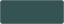
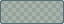
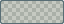
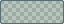
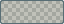

# DeepSeaFoam color reference

Generated from the [dark source](../palette/deepseafoam.json) and [Harbor Daylight source](../palette/harbor-daylight.json).
The dark inventory remains 27 core values plus 19 independent terminal values.
Harbor Daylight adds 12 solids and 4 overlays; it does not recolor existing native exports.
See [light-role guidance](HARBOR-DAYLIGHT.md), [application mappings](MAPPINGS.md) and the [project guide](GUIDE.md).
All eight-digit values use alpha-last RGBA. Overlay swatches below use a neutral checkerboard, not a contrast guarantee.

## Core interface palette

| Role | Color |
| --- | --- |
| Near-black teal workspace and recessed surface |  `#000F13` |
| Headers, toolbars, and surrounding panels |  `#001E26` |
| Rich seafoam interaction, focus, and active outline |  `#00A591` |
| Primary text and primary-action hover |  `#93A1A1` |
| Genuinely lower-emphasis labels and markers |  `#839496` |
| Warm emphasis, headings, and notices |  `#EEE8D5` |
| Precise light selection edge |  `#FDF6E3` |
| Strong structural border |  `#586E75` |
| Vivid green document indicator |  `#45D072` |
| Bright yellow warning indicator |  `#EBE565` |
| Vivid rose error boundary and indicator |  `#E84A5F` |

## Harbor Daylight

| Role | Color |
| --- | --- |
| Warm limestone page background |  `#F3F2E9` |
| Sea-glass panels and structure |  `#E3ECE7` |
| Raised paper and filled-action text |  `#FCFAF2` |
| Deep sea-slate body text |  `#355451` |
| Readable secondary ink |  `#536B66` |
| Tidal headings and selected text |  `#173D3A` |
| Solid structural edge, not text |  `#6B857E` |
| Daylight seafoam interaction |  `#006F63` |
| Deeper kelp action hover |  `#00594F` |
| Labeled document indicator |  `#247449` |
| Ochre caution ink |  `#77600E` |
| Berry error ink |  `#AD3E55` |

## Daylight overlays

| Role | Color |
| --- | --- |
| Decorative separator, 40% alpha |  `#6B857E66` |
| Hover wash; use heading ink |  `#6B857E1A` |
| Text selection; use heading ink |  `#006F631F` |
| Transparent black shadow |  `#00000014` |

Button text reuses paper. Shared safety fill/ink, sunset and pearl reference dark warning/base, heritage orange and light edge.
Ordinary selection and hovered labels use heading ink. Filled-action selection keeps paper ink on the opaque accent-hover fill.

## Transparent overlays

| Role | Color |
| --- | --- |
| Quiet structural separation |  `#586E7566` |
| Subtle interaction acknowledgement |  `#586E7533` |
| Soft shadow |  `#00000066` |
| Strong shadow |  `#000000CC` |
| Modal backdrop |  `#000000B8` |
| Faint pixel grid |  `#002B3630` |
| Symmetry guide |  `#00A59188` |
| Brush cursor |  `#FDF6E3AA` |

## Preview-only neutrals

These are preview materials, not the light companion.

| Role | Color |
| --- | --- |
| Main checkerboard light square |  `#D0D1C9` |
| Main checkerboard dark square |  `#B2B5AE` |
| Navigator preview shade one |  `#292E33` |
| Navigator preview shade two |  `#30363B` |
| Comparison preview shade one |  `#30373A` |
| Comparison preview shade two |  `#394143` |
| Frame-thumbnail background |  `#343B40` |
| Layer-thumbnail background |  `#191D22` |

## Higher-contrast terminals

These retain their supplied non-background values. The workspace stays  `#000F13`.

| Role | Color |
| --- | --- |
| Terminal foreground |  `#9CC2C3` |
| Terminal cursor |  `#F34B00` |
| Terminal selection |  `#003748` |
| ANSI black |  `#002831` |
| ANSI red |  `#F54F65` |
| ANSI green |  `#6CBE6C` |
| ANSI yellow |  `#EDAE29` |
| ANSI blue |  `#2176C7` |
| ANSI magenta |  `#C61C6F` |
| ANSI cyan |  `#259286` |
| ANSI white |  `#EAE3CB` |
| ANSI bright black |  `#006488` |
| ANSI bright red |  `#F5858C` |
| ANSI bright green |  `#51EF84` |
| ANSI bright yellow |  `#FFF96E` |
| ANSI bright blue |  `#178EC8` |
| ANSI bright magenta |  `#E24D8E` |
| ANSI bright cyan |  `#00B39E` |
| ANSI bright white |  `#FCF4DC` |

## Syntax heritage

Four retained Solarized extensions; not daylight text roles or terminal replacements.

| Role | Color |
| --- | --- |
| Syntax role not defined by the original UI |  `#CB4B16` |
| Syntax role not defined by the original UI |  `#D33682` |
| Syntax role not defined by the original UI |  `#6C71C4` |
| Syntax role not defined by the original UI |  `#268BD2` |
