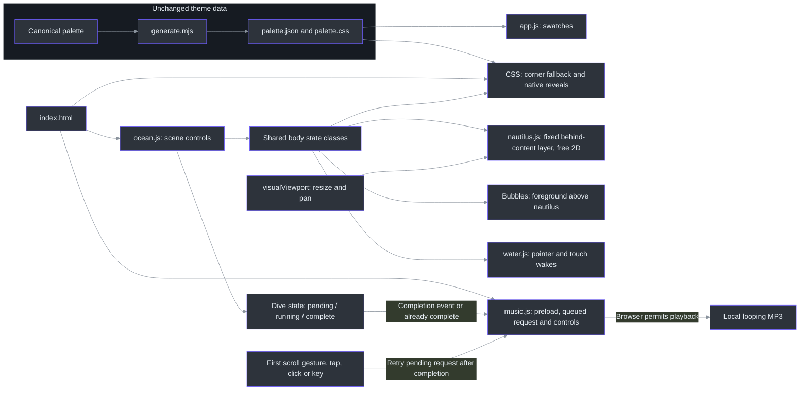
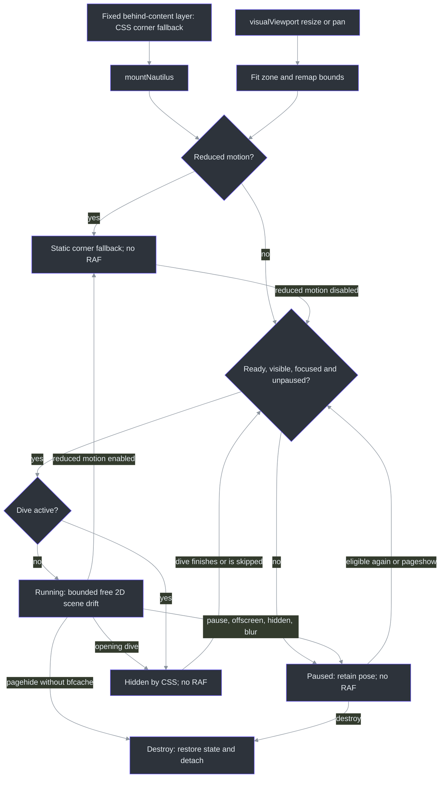

# DeepSeaFoam showcase

## Overview: atmosphere without changing the theme

The showcase makes the workspace hierarchy tangible before asking visitors to choose an application. It is a progressively enhanced static site, not an application screenshot. The HTML/CSS study and exact palette stay separate from decorative scenery. **0.7.0 expands the gallery to 21 destinations**, including a clearly manual Nova Launcher recipe; BetterDiscord reuses the existing Discord card. Counts do not imply identical importers, installed-client coverage or marketplace acceptance. Palette colors remain unchanged. See the [gallery](../site/index.html), [generator](../scripts/generate.mjs) and [release boundaries](releases/v0.7.0.md).

The hero has no eyebrow. Its four-line poem reads:

> Deep teal water. Quiet light.<br>
> Seafoam signals through the night.<br>
> A little warmth, a clearer view.<br>
> A home for all the work you do.

**Find your app** sits beside **Explore the palette**, using the existing document green `#45D072` with dark text. These are navigation choices, not new theme colors. ([site/index.html:134–150](../site/index.html#L134-L150), `.button-applications`, [site/styles.css:299–306](../site/styles.css#L299-L306), [site/palette.css:11](../site/palette.css#L11))

The reading path is **hero/workspace → surface hierarchy → editorial rationale/photo reference → palette → applications → interaction study → anglerfish → download → footer/blobfish**. Applications immediately follow the palette. The nautilus is no longer an inline section or spacer: it occupies a root-level scene layer independently of document flow, above the ocean but below readable content. The old four principle cards, four-item signal legend, and heritage/extension block are retired from the page; the research narrative and interaction study remain. Creature placement is composition, not biological depth ordering, and the 0–2,000 m gauge is explicitly narrative. ([site/index.html:70–86](../site/index.html#L70-L86), [site/index.html:228–327](../site/index.html#L228-L327), [site/index.html:445–579](../site/index.html#L445-L579), [scripts/validate-site.mjs:257–279](../scripts/validate-site.mjs#L257-L279), `updateScene`, [site/ocean.js:71–91](../site/ocean.js#L71-L91))

## Architecture

### Harbor Daylight and visual documentation

The palette section now includes the separate [Harbor Daylight companion](HARBOR-DAYLIGHT.md):
12 solids and 4 overlays from `palette/harbor-daylight.json`. The dark 27-value inventory,
terminal extension and native exports are unchanged. The light notes study uses opaque
paper/sea-glass surfaces, heading-colored selection, and paper ink on accent-filled
actions (including selected button text). It is a simulated web interface, not a native port.
Both palettes have copy controls and a no-JavaScript/error link to [the full reference](PALETTE.md).
The surrounding ocean remains dark; this adds palette data and a light study, not a
global scene-theme switch.

Author showcase styles in [`scripts/templates/showcase.css`](../scripts/templates/showcase.css).
Generation removes only blank lines and line indentation into `site/styles.css`, keeping
the existing 3 MiB / 320 KiB / 272 KiB asset caps without dropping licenses or altering
media. Escaped CSS line continuations are rejected rather than compacted ambiguously.
Earlier stylesheet line citations below refer to the authored rules; deployed CSS is
now compacted. Generated reusable [`palette/harbor-daylight.css`](../palette/harbor-daylight.css)
scopes its tokens and selection rules to `.harbor-daylight`.

The README uses a local typographic SVG, the 23 dark/light interface swatches and two
browser captures of these HTML/CSS studies. Images live under `docs/previews`, outside
the deployed website. Installation, behavior, provenance and full color inventories
are in the [guide](GUIDE.md) and [color reference](PALETTE.md).



The modules load independently from HTML; palette loading is not a prerequisite. Shared body classes coordinate motion, while music uses a separate **dive-completion handshake**: HTML starts with `data-dive-state="pending"`, `dive` sets `running`, and `finishDive` sets `complete`. Ocean emits `deepseafoam:dive-complete` once for each transition to completion, except while hidden or handling `pagehide`. Music also checks the current state when it mounts, so an already-skipped intro is not missed. Motion pause/reduced motion do not mute playback; they can finish the intro and make its initial request eligible. The diagram describes state/event flow, not JavaScript imports. ([site/index.html:16–25](../site/index.html#L16-L25), `dive` / `finishDive`, [site/ocean.js:50–69](../site/ocean.js#L50-L69), `syncMotion`, [site/ocean.js:102–114](../site/ocean.js#L102-L114), [site/ocean.js:159–181](../site/ocean.js#L159-L181), `startAutomatic`, [site/music.js:79–101](../site/music.js#L79-L101), [site/music.js:135–145](../site/music.js#L135-L145))

The nautilus zone is **fixed, `aria-hidden`, and pointer-transparent across the full viewport**, outside `main`. It uses `z-index: 1`, above the ocean world at `0` but below `main` and `footer` at `2`; the fish therefore keeps its full roaming area without painting over text or controls. Foreground kelp and bubbles remain above it at `4` and `6`. During the opening dive, `.is-diving` hides the nautilus zone and its controller suspends motion. ([site/index.html:70–91](../site/index.html#L70-L91), [site/ocean.css:1–16](../site/ocean.css#L1-L16), [site/ocean.css:109–147](../site/ocean.css#L109-L147), [site/ocean.css:343–354](../site/ocean.css#L343-L354), [site/nautilus.js:210–214](../site/nautilus.js#L210-L214))

The two **lens-close foreground plants** frame the viewport without sharing the reading corridor. A stationary mask fades each side to transparent at `--kelp-edge`, clamped between 20 and 128 CSS pixels; swaying the images cannot move that boundary. Vertical insets keep foliage away from the header and fixed controls, while a separate vertical mask softens the cropped ends. The existing SVG receives `blur(5px) brightness(1.6)` only in this layer, with offset 7.5/9.5-second `near-sway` animations. Mobile footer credits use the same narrower width as the footer grid to stay outside the edge strips. The plants remain decorative and pointer-transparent, and the shared freeze rules cover pause, hidden pages and no-JavaScript startup. ([site/index.html:64–68](../site/index.html#L64-L68), [site/ocean.css:7–13](../site/ocean.css#L7-L13), [site/ocean.css:109–124](../site/ocean.css#L109-L124), [site/ocean.css:400](../site/ocean.css#L400), [site/ocean.css:420–457](../site/ocean.css#L420-L457))

### Components

| Component | Responsibility and source |
| --- | --- |
| Palette generation | `sitePalette` includes the three core groups; CSS also exposes the extension variables used by studies. The generator passes shared `exportContext` to `addChatThemes`, `addDesktopThemes` and `addMonkeytypeTheme`, keeping exports tied to canonical roles. Do not hand-edit generated assets. ([scripts/generate.mjs:1–27](../scripts/generate.mjs#L1-L27), [scripts/generate.mjs:689–692](../scripts/generate.mjs#L689-L692), [scripts/generate.mjs:726–766](../scripts/generate.mjs#L726-L766)) |
| Palette UI | `loadPalette` fetches local JSON; `renderPalette` creates accessible copy buttons for the dark and daylight groups. Failure displays a linked full-reference fallback; `copyValue` has a clipboard fallback. ([site/app.js](../site/app.js)) |
| Scene controls | `dive`, `finishDive`, `syncMotion`, and `updateScene` own the intro, completion state/event, pause state, narrative depth and bubbles. Completion is not emitted while hidden or handling page departure. ([site/ocean.js:21–114](../site/ocean.js#L21-L114), [site/ocean.js:159–181](../site/ocean.js#L159-L181)) |
| Background music | `mountMusic` preloads an eligible fresh request, gates playback on dive completion, and retries policy-blocked startup synchronously on eligible genuine gestures. Wheel/trackpad and one-finger swipes share one scroll attempt. Explicit cancel/pause, real failures and lifecycle departure revoke the request; direct controls and status remain. ([site/music.js:7–145](../site/music.js#L7-L145), [scripts/test-music.mjs:68–337](../scripts/test-music.mjs#L68-L337)) |
| Interactive water | `WaterField.wake` models directional pressure; `tap` creates a smooth depression and displaced rim. Both propagate through the same damped field. `mountWater` renders local-light refraction behind content. This is stylized, not fluid-accuracy validation. ([site/water.js:24–90](../site/water.js#L24-L90), [site/water.js:140–215](../site/water.js#L140-L215), [site/index.html:28–63](../site/index.html#L28-L63), [site/ocean.css:1–16](../site/ocean.css#L1-L16)) |
| Nautilus | Pure model functions choose two-axis drift legs; `mountNautilus` owns one animation frame loop, visual-viewport fitting, observers, and cleanup. ([site/nautilus.js:38–149](../site/nautilus.js#L38-L149), [site/nautilus.js:158–342](../site/nautilus.js#L158-L342)) |
| Application gallery | Twenty-one source-linked cards describe app-specific support, with nineteen sourced product marks and two disclosed original text identifiers. Monkeytype uses a documented brand-yellow fill-only derivative of the Simple Icons mark. These are export links, not screenshots or proof of native import compatibility. ([site/index.html:327–443](../site/index.html#L327-L443), [site/styles.css:1210–1255](../site/styles.css#L1210-L1255), [docs/application-icons.json:95–259](application-icons.json#L95-L259)) |
| Creature reveals | Native checkboxes and CSS reveal/retract the angler and footer blobfish; no disclosure script or expanding card is required. ([site/index.html:475–508](../site/index.html#L475-L508), [site/index.html:548–579](../site/index.html#L548-L579), [site/ocean.css:354–392](../site/ocean.css#L354-L392)) |

## Data flow and interaction lifecycle

The no-JavaScript fallback parks the nautilus near the **lower-right corner** (`left: 80%; top: 75%`, with smaller maximum dimensions), beneath readable content rather than in front of it. Unsupported animation APIs leave that fallback intact. Reduced motion removes the inline motion transform and selects the same static corner state; ordinary pause instead freezes the current swimming pose. With an unchanged viewport, scrolling the document does not move that paused scene-layer location. Eligible animation starts from the centered model, and resuming resets the frame clock so suspended time is not replayed. ([site/ocean.css:343–354](../site/ocean.css#L343-L354), `createDrift`, [site/nautilus.js:54–65](../site/nautilus.js#L54-L65), `mountNautilus` / `sync`, [site/nautilus.js:159–174](../site/nautilus.js#L159-L174), [site/nautilus.js:216–256](../site/nautilus.js#L216-L256))



`blocked` also handles collapsed bounds and shared `page-hidden` state. Intersection/resize observers are event-driven, with scroll/resize fallbacks. Persisted page navigation suspends the controller for back/forward-cache restoration; non-persisted departure destroys it. Cleanup restores the original transform, state attribute, and zone sizing, and detaches viewport listeners as well as the other observers/listeners. ([site/nautilus.js:202–218](../site/nautilus.js#L202-L218), [site/nautilus.js:258–342](../site/nautilus.js#L258-L342))

`fitViewport` uses native `visualViewport.width`, `height`, `offsetLeft`, and `offsetTop`. Its resize and scroll events refit the fixed zone when browser chrome, pinch zoom, or visual-viewport panning changes the visible rectangle; no zoom gesture is intercepted. Window resize remains a fallback when `visualViewport` is unavailable. Responsive SVG dimensions and rotated-rectangle margins keep the fish inside that zone. A shrinking viewport can require repositioning into smaller bounds, including while paused; this is distinct from a swimming turn, which preserves continuous position, velocity, and acceleration. ([site/nautilus.js:11–26](../site/nautilus.js#L11-L26), `resizeDrift`, [site/nautilus.js:134–149](../site/nautilus.js#L134-L149), [site/nautilus.js:179–196](../site/nautilus.js#L179-L196), [site/nautilus.js:258–282](../site/nautilus.js#L258-L282), [site/ocean.css:344–351](../site/ocean.css#L344-L351))

The other effects have separate lifecycles:

- **Intro and bubbles:** skip, Escape, Tab, navigation, pressing, and scrolling bypass the intro. `finishDive` records completion and emits its music handshake only on a new visible completion, never during pagehide. A primary `pointerdown` emits bubbles at the contact point before finger release; subsequent compatibility clicks do not emit again. Scroll emissions use the visual viewport's bottom, are frame-coalesced/rate-limited, and share a 64-node cap. Pause, reduced motion, hiding, and departure clear them. (`finishDive`, `bubblesAt`, `updateScene`, [site/ocean.js:23–114](../site/ocean.js#L23-L114), [site/ocean.js:116–181](../site/ocean.js#L116-L181))
- **Water:** fine-pointer mouse/pen movement and single-finger touch gestures create disturbances. `touchstart` injects a tap; passive `touchmove` continues directional wakes after native scrolling causes `pointercancel`. No pointer capture, `preventDefault`, or restrictive touch-action is needed. Multi-touch and cancelled contacts stop tracking; browser-chrome resizes reanchor the active contact rather than inventing a long stroke. Pause, reduced motion, blur, hiding, and navigation clear the field; rendering stops once it settles. (`startTouch`, `moveTouch`, `resize`, [site/water.js:113–138](../site/water.js#L113-L138), [site/water.js:191–309](../site/water.js#L191-L309))
- **Native reveals:** click/tap or Space on the focused checkbox toggles each creature. Hover/focus alone does not reveal the angler. Blobfish kelp parts outward and the image rises within a fixed-height, responsive hideout; unchecking retracts it without changing section height. These controls work without JavaScript; reduced motion suppresses transitions rather than removing the controls. ([site/index.html:475–479](../site/index.html#L475-L479), [site/index.html:548–579](../site/index.html#L548-L579), [site/ocean.css:354–392](../site/ocean.css#L354-L392), [site/styles.css:1713–1730](../site/styles.css#L1713-L1730))

The footer cover uses **20 instances of the same kelp SVG**, each sized with `width: clamp(200px, 40%, 336px)` and its natural aspect ratio. The fish itself has no CSS opacity reduction or filter, preserving its painted colors rather than dimming it to simulate concealment. When changing responsive sizes, inspect the whole sway cycle: a frond count alone does not establish concealment. ([site/index.html:555–574](../site/index.html#L555-L574), `.blobfish` / `.cover-kelp`, [site/ocean.css:357–370](../site/ocean.css#L357-L370))

## Implementation details

### Nautilus: free two-axis roaming at threefold nominal speed

`SPEED_MULTIPLIER = 3` raises nominal translation targets from **10–28 to 30–84 CSS pixels per second**, while sampled leg durations remain **4–10 seconds**. Edge handling may request a new inward leg sooner. These are targets, not constant measured screen speeds: damping eases into motion, normalized rates are capped, and soft confinement slows travel near an edge. The threefold change also scales the normalized rate limit; it does not triple leg timing or guarantee every rendered displacement is exactly three times its predecessor. ([site/nautilus.js:1–9](../site/nautilus.js#L1-L9), `chooseLeg` / `stepDrift`, [site/nautilus.js:38–50](../site/nautilus.js#L38-L50), [site/nautilus.js:81–115](../site/nautilus.js#L81-L115), [scripts/test-nautilus.mjs:54–64](../scripts/test-nautilus.mjs#L54-L64))

`chooseLeg` samples an angle over the full circle, giving left/right, up/down, and diagonal travel; successive legs may repeat a quadrant. Each axis retains its own position, velocity, and acceleration. `advanceAxis` applies the exact critically damped velocity filter separately to both axes, and `axisPose` applies soft `tanh` confinement to both positions. Vertical motion is genuine roaming, no longer a small periodic bob. `driftPose` retains only a small bounded decorative rotation. There is no positional wrapping, teleporting on turns, or mandatory left/right alternation. The pure model is repeatable for a fixed seed; browser mounting supplies a fresh seed. ([site/nautilus.js:29–132](../site/nautilus.js#L29-L132), [site/nautilus.js:190–196](../site/nautilus.js#L190-L196), [scripts/test-nautilus.mjs:25–51](../scripts/test-nautilus.mjs#L25-L51), [scripts/test-nautilus.mjs:109–140](../scripts/test-nautilus.mjs#L109-L140))

Conceptually, preserving the implementation's separation:

```text
state = createDrift(dimensions, seed)
on eligible animation frame:
    state = stepDrift(state, elapsed)   // at most 50 ms; discard long-frame backlog
    pose = driftPose(state)            // independently bounded x/y plus small rotation
    render pose                       // no per-frame layout measurement
on pause: cancel frame; reset clock; keep pose
on reduced motion: reset model; remove inline transform; use CSS corner fallback
on visual viewport resize or pan: fit zone; remap model to the available bounds
```

The frame limit and render path are explicit, and resize remaps the existing pose into new bounds rather than adding another loop. Turn-continuity tests reduce the time step and require position, velocity, and acceleration changes to converge toward zero; acceleration need not be identical across a finite interval because jerk is finite. ([site/nautilus.js:81–105](../site/nautilus.js#L81-L105), `resizeDrift`, [site/nautilus.js:134–149](../site/nautilus.js#L134-L149), [site/nautilus.js:220–265](../site/nautilus.js#L220-L265), [scripts/test-nautilus.mjs:109–153](../scripts/test-nautilus.mjs#L109-L153))

### Application gallery: 21 targets, different support boundaries

Every card links to its target directory and uses local decorative artwork with
empty alternate text, fixed 48-pixel dimensions and native lazy loading; adjacent
headings supply product names. The gallery retains three columns on wider layouts
and one on narrow layouts. There are nineteen product marks and two original
text identifiers (rofi and Nova Launcher), explicitly not official logos.
Three larger new marks use lossless 144px WebP renderings; their unchanged SVG
render sources remain in `docs/icon-sources`, outside the deployed site.
See [markup](../site/index.html), `.application-grid` and `.app-card-top img` in
[styles](../site/styles.css), and [artwork notices](../site/icons/NOTICE.txt).

| Added target | Format and limitation shown by the gallery |
| --- | --- |
| Discord / BetterDiscord | One unofficial CSS theme for existing BetterDiscord or Vencord clients; **not a stock Discord import**. ([guide](../targets/discord/README.md)) |
| Telegram Desktop | Native desktop theme format for chat/navigation/control surfaces; the target is Telegram Desktop, not a claim about every Telegram client. ([site/index.html:367–371](../site/index.html#L367-L371)) |
| Slack | Limited native four-color preset, not whole-client CSS; Slack controls the remaining surfaces. The gallery deliberately labels this a preset rather than full-client theming. ([site/index.html:372–376](../site/index.html#L372-L376)) |
| Chromium / Chrome and Edge | Browser-theme manifest for browser-owned chrome, without website CSS, scripts, or permissions. ([site/index.html:377–381](../site/index.html#L377-L381)) |
| JetBrains IDEs | Theme-only plugin containing IDE and editor colors. ([site/index.html:382–386](../site/index.html#L382-L386)) |
| Sublime Text | Editor/syntax color scheme paired with the built-in Adaptive UI, not a standalone complete UI theme. ([site/index.html:387–391](../site/index.html#L387-L391)) |
| Alacritty | TOML colors using the existing higher-contrast terminal palette. ([site/index.html:392–396](../site/index.html#L392-L396)) |
| Monkeytype | Native colors-only custom-theme share link; warm typing text, seafoam signals and unrelated settings preserved. No login requirement or full-settings import. ([site/index.html:397–401](../site/index.html#L397-L401), `addMonkeytypeTheme`, [scripts/monkeytype-theme.mjs:3–53](../scripts/monkeytype-theme.mjs#L3-L53)) |
| Notepad++ | Native XML for editor/lexers; separate optional Dark Mode chrome. ([guide](../targets/notepad-plus-plus/README.md)) |
| Zsh | Dependency-free prompt, not a terminal-emulator color scheme. ([guide](../targets/zsh/README.md)) |
| rofi | Native Rasi over the default layout; selection, active and urgent states. ([guide](../targets/rofi/README.md)) |
| Xfce4 Terminal | Native color preset with the shared terminal palette; not GTK chrome. ([guide](../targets/xfce4-terminal/README.md)) |
| Termux | Native colors.properties, without a selection-color property. ([guide](../targets/termux/README.md)) |
| GitHub Pages | Static website starter plus optional Jekyll layout, not a github.com reskin. ([guide](../targets/github-pages/README.md)) |
| Godot Engine | Native .tet script-editor colors; optional manual chrome, no game-resource edits. ([guide](../targets/godot/README.md)) |
| Nova Launcher | Manual, version-dependent Android launcher controls; no backup importer or icon pack. ([guide](../targets/nova-launcher/README.md)) |

The [validator](../scripts/validate-site.mjs) checks all 21 card IDs, source/asset
hashes, passive SVGs, lossless raster signatures/dimensions and required notices.
It reverses each documented root-fill/newline edit to recover the original
Simple Icons hash. Monkeytype's existing official-yellow derivation is unchanged.
The five new Simple Icons marks use their metadata brand colors; Godot has a
separate CC BY 4.0 license/credit, and Termux retains its specific Commons
PD-shape provenance. These are identification assets, not endorsement or evidence
of installed-app testing. See [the complete ledger](application-icons.json).

The pinned Simple Icons license and existing `LICENSE-logos.txt` contain the same complete **CC0 1.0 Universal** terms, with only wrapping, Markdown/quotation/list-label differences and the HTTP/HTTPS notice URL. Reusing that full license avoids an unnecessary duplicate and fits the existing caps. The source license hash, shared license hash and comparison are recorded; the validator checks the shared file's bytes. CC0 does not grant trademark rights, and no affiliation or endorsement is asserted. ([docs/application-icons.json:101–105](application-icons.json#L101-L105), [site/icons/LICENSE-logos.txt:1–116](../site/icons/LICENSE-logos.txt#L1-L116), [site/icons/NOTICE.txt:12–33](../site/icons/NOTICE.txt#L12-L33), [scripts/validate-site.mjs:103–109](../scripts/validate-site.mjs#L103-L109))

### Photographic inspiration: a visible, attributed preview

The inspiration is **[Bay with Orange Seashore Under White and Gray Clouds](https://www.pexels.com/photo/bay-with-orange-seashore-under-white-and-gray-clouds-8567869/)**, Pexels photo **8567869**, by **[JJ Perks](https://www.pexels.com/@jj-perks-868548/)**. The `#photo-reference` figure now displays the actual photograph, replacing the earlier text-only reference. Its local **800 x 534 WebP is 47,570 bytes**; the complete composition remains visible without a theme filter. The caption sits beside the image on desktop and below it on narrow screens. Native dimensions reserve space, descriptive `alt` supplies a text alternative, and the inset keyboard outline remains visible inside the rounded frame. ([site/index.html:302–308](../site/index.html#L302-L308), [site/ocean.css:458–464](../site/ocean.css#L458-L464), [docs/showcase-artwork.json:17–43](showcase-artwork.json#L17-L43))

The preview loads lazily from this site and works without JavaScript. **The 5,476,996-byte original JPEG is not bundled or automatically requested**; opening the image or original link explicitly navigates to the [7952 x 5304 source](https://images.pexels.com/photos/8567869/pexels-photo-8567869.jpeg). The photographer and photo-page links remain visible, and the footer jumps directly to the figure. The validator checks WebP bytes/hash/dimensions, the 48 KiB photo allowance, attribution and semantic markup, and still prohibits external runtime image loading. ([site/index.html:302–308](../site/index.html#L302-L308), [site/index.html:539–541](../site/index.html#L539-L541), [scripts/validate-site.mjs:162–191](../scripts/validate-site.mjs#L162-L191), [scripts/validate-site.mjs:309–315](../scripts/validate-site.mjs#L309-L315))

`prepare-photo.py` uses Pillow offline: it applies EXIF orientation, converts an embedded profile to sRGB when present, resizes the full frame with Lanczos, and encodes WebP at quality 65/method 6 without source metadata. The actual source has no embedded profile and orientation is 1. It rejects invalid dimensions/quality, source overwrite, existing output, and results larger than 48 KiB. Reproduce into a **new destination** using the original download, not the preview; output/source hashes are printed. This is lossy downsampling, not pixel identity with the original. ([scripts/prepare-photo.py:12–53](../scripts/prepare-photo.py#L12-L53), [docs/showcase-artwork.json:27–41](showcase-artwork.json#L27-L41))

```powershell
python scripts\prepare-photo.py "$downloadedJpeg" "$newWebp" --width 800 --quality 65
```

The official Pexels help pages retrieved for this change permit website/commercial use and list restrictions, including no implied endorsement, stock/wallpaper redistribution or use as a trademark. The standalone license page returned 403; retaining its URL is not a claim that its full text was fetched. The caption is a visual-inspiration credit, not palette-sampling evidence or photographer endorsement, and the photo remains outside the theme/code MIT grant. ([Pexels use permission](https://help.pexels.com/hc/en-us/articles/360042295214-Can-I-use-the-photos-and-videos-for-a-commercial-project), [Pexels rules](https://help.pexels.com/hc/en-us/articles/360042332714-What-are-the-rules-for-using-Pexels-photos-or-videos), [docs/showcase-artwork.json:25–43](showcase-artwork.json#L25-L43), [site/artwork-NOTICE.txt:22–30](../site/artwork-NOTICE.txt#L22-L30), [LICENSE:11–16](../LICENSE#L11-L16))

### Default background music

The owner supplied a **176-second, stereo, 48 kHz, 16-bit PCM WAV**. The complete recording is encoded as **128 kbps MP3, 2,817,068 bytes**, with metadata removed and no trimming, gain, speed or pitch changes. The original WAV is not committed. A small standard-library Python wrapper invokes an existing FFmpeg/libmp3lame encoder, refuses to overwrite either the source or an existing output, and reports source/output hashes and metadata. Reproduction needs the private source and an encoder; neither is a browser dependency. ([scripts/prepare-music.py](../scripts/prepare-music.py), [docs/showcase-artwork.json](showcase-artwork.json))

```powershell
python scripts\prepare-music.py "$sourceWav" site\audio\deepseafoam-music.mp3 --ffmpeg "$ffmpeg"
```

The HTML audio element retains `preload="none"` and **no initial `src`**.
On an eligible fresh visible load, `mountMusic` assigns the source, changes
preload to `auto` and shows **Cancel music** while the intro is pending/running.
The automatic request does not call `audio.play()` until `data-dive-state` is `complete`.
The completion event or an already-complete state at mount starts that request;
no-animation, deep-link and reduced-motion openings can therefore start
immediately. This is a narrow event/state dependency on ocean, not coupling
playback to ongoing scene motion. ([site/index.html:25](../site/index.html#L25),
[site/index.html:92–103](../site/index.html#L92-L103),
`startAutomatic`, [site/music.js:79–101](../site/music.js#L79-L101),
[site/music.js:135–145](../site/music.js#L135-L145),
[site/ocean.js:175–181](../site/ocean.js#L175-L181))

An automatic `NotAllowedError` keeps `automaticPending` set and announces
**"Sound is ready. Scroll, tap or click to try music."** Eligible genuine
pointer/key/touch/click events retry synchronously through `audio.play()` before
any await; finding the Play button is not required. The first nonzero `wheel`
(including a trackpad) or single-finger `touchmove` also attempts startup.
These share one scroll attempt per mount, so a blocked scroll cannot create a
retry storm. A scroll during the intro still waits for the existing completion
handshake. No raw `scroll` listener is used for music: even trusted browser scroll
notifications can result from script or restoration rather than user input.

Synthetic events, key repeats, Ctrl/Meta/Alt-modified shortcuts and multi-touch
moves are ignored. Capture listeners are passive: they neither prevent the
gesture's normal action nor use a muted-start/unmute workaround. Music-button
activations are excluded from page-wide recovery so the same activation cannot
start then immediately pause music, or defeat queued Cancel; scrolling over the
control is not an activation. Browsers still control audible playback and may
reject scrolling as permission for sound. After a blocked scroll, status says
**"Your browser still blocks sound. Tap, click or press a key."** Those recovery
paths remain available. **Neither zero-interaction nor scroll-only sound is
guaranteed.** There is no timer-based retry loop.
(`fail`, [site/music.js:37–77](../site/music.js#L37-L77),
`interact`, [site/music.js:82–105](../site/music.js#L82-L105))

Explicit **Cancel music** revokes queued/loading startup; **Pause music**
preserves position and prevents later page gestures from restarting playback.
Real media failures switch to **Retry music** and also revoke automatic retries.
Hidden/pagehide transitions cancel a pending request or pause playback;
visibility/history return stays silent, including reconstructed `back_forward`
navigation. Initially hidden loads do not preload or queue automatic music.
Fresh navigation/reload is eligible again. Stale play promises cannot revive a
cancelled request or interfere with a newer one. Playback loops at 0.35 element
volume where supported; phone hardware volume remains authoritative. Explicit
Play/Retry controls and live status remain available. ([site/music.js:7–13](../site/music.js#L7-L13),
[site/music.js:21–77](../site/music.js#L21-L77),
[site/music.js:102–145](../site/music.js#L102-L145))

The fixed dock retains 44px minimum controls, safe-area offsets, and separate
skip/status overlays. `#music-toggle` and `#motion-toggle` have a **static**
1px border mixing 70% seafoam with panel color, plus a 9px halo at 18% seafoam.
This is not an animation and does not depend on motion preferences; the music
error state retains its distinct warning inset. No-JavaScript mode uses a direct
MP3 link and does not request audio until that link is followed.
([site/ocean.css:277–314](../site/ocean.css#L277-L314),
[site/index.html:92–103](../site/index.html#L92-L103))

Browser acceptance must cover intro preloading without early playback,
immediate/skipped completion, policy-allowed and blocked startup, first
wheel/trackpad and touch-scroll attempts, burst deduplication, genuine
keyboard/tap/click recovery, queued Cancel, explicit Pause, control-gesture
races, real failures, navigation silence and narrow/no-JavaScript layouts.
Automation must not grant activation through evaluation before scroll-only
probes. These are acceptance requirements, not a claim that this documentation
update ran them.

The user supplied the recording for website playback, but its original artist
and redistribution license were not supplied. Do not infer that the music is
original to this project, royalty-free or covered by the theme/code MIT grant.
Preserve its separate notice and hashes. ([site/artwork-NOTICE.txt](../site/artwork-NOTICE.txt))

### Blobfish preparation and shared branding

The footer blobfish is **user-supplied artwork whose original artist and license were not supplied**. Do not label all showcase artwork original or infer a blanket redistribution license. The input already had transparency; this is cleanup and conversion, not invented background removal or repainting. The private source is not distributed; reproducing the derivative requires that source, not just its recorded hash. ([site/artwork-NOTICE.txt:1–8](../site/artwork-NOTICE.txt#L1-L8), [docs/showcase-artwork.json:3–9](showcase-artwork.json#L3-L9))

The optional Pillow tool's `main` validates a distinct, transparent RGBA input, retains the center-connected foreground and soft fringe, removes detached specks, crops with padding, resizes with Lanczos, and encodes WebP. It prints hashes, dimensions, crop, quality, and byte size for comparison with metadata. The recorded derivative is **640×345, quality 82, 43,364 bytes**. Pillow is an offline preparation dependency, not a browser dependency. ([scripts/prepare-blobfish.py:8–52](../scripts/prepare-blobfish.py#L8-L52), [docs/showcase-artwork.json:10–15](showcase-artwork.json#L10-L15))

With `$sourcePng` set to the privately retained PNG path and Pillow already available:

```powershell
python scripts\prepare-blobfish.py "$sourcePng" site\blobfish.webp --width 640 --quality 82
```

The shared `mark.svg` paints **18 lower-half foam circles and five reflection paths** after the seaweed. HTML and webmanifest references use `seaweed-foam-cluster`; the same mark supplies header, footer, study, favicon, and web-app icon. Background scenery has ten kelp clusters plus two foreground edge clusters; the footer hideout has its own twenty-cluster cover. Product marks have separate notices, not the blobfish's provenance. ([site/mark.svg:4–34](../site/mark.svg#L4-L34), [site/index.html:14–15](../site/index.html#L14-L15), [site/index.html:45–68](../site/index.html#L45-L68), [site/index.html:109–113](../site/index.html#L109-L113), [site/index.html:163–167](../site/index.html#L163-L167), [site/index.html:529–574](../site/index.html#L529-L574), [site/site.webmanifest:9–14](../site/site.webmanifest#L9-L14), [site/icons/NOTICE.txt:1–33](../site/icons/NOTICE.txt#L1-L33))

### Validation and publication boundaries

`npm test` includes generated freshness, the static-site validator, and the ocean, water, color, nautilus, application-target and music suites. The music suite covers preload/completion gating, queued Cancel, policy-blocked genuine-gesture recovery, control-gesture races, hidden/history initialization, stale play promises, real failures, media events and teardown. The nautilus suite defines **20 tests**, covering seeded two-axis travel, the exact threefold pre-confinement speed relationship, bounded/continuous turns, pause, reduced motion, visibility, resize, visual-viewport resize/pan handling, fallback APIs, and cleanup. These are source-level test contracts, not a claim that this documentation update ran tests or that a deployed revision passed browser validation. ([package.json:8](../package.json#L8), [scripts/test-music.mjs:62–221](../scripts/test-music.mjs#L62-L221), [scripts/test-music.mjs:222–299](../scripts/test-music.mjs#L222-L299), [scripts/test-nautilus.mjs:12–188](../scripts/test-nautilus.mjs#L12-L188), [scripts/test-nautilus.mjs:279–500](../scripts/test-nautilus.mjs#L279-L500))

The cap remains **3 MiB across every deployed file**, including the unchanged
2,817,068-byte MP3. The photo retains its **48 KiB allowance**. Eight additional
cards/identifiers/notices explicitly receive **16 KiB**, changing the remaining
asset cap from 256 to **272 KiB**, and the non-audio cap to **320 KiB**.
Three new complex marks are delivered as small, lossless 144px WebP renderings
instead of their larger SVG sources; source geometry and rendered pixels are
preserved. Every deployed license, notice and `.nojekyll` still counts.
The original SVG render sources are retained in the repository, not silently
excluded deployed assets. See `listAssets`, `totalBytes` and `interfaceBytes` in
[the validator](../scripts/validate-site.mjs).

The foreground contract additionally retains decorative local plants, the bounded side mask, soft blur and dedicated sway. Browser review must inspect text bounds throughout the page (including narrow footer credits), compare foreground-on/off pixels outside the edge strips, and sample both plants across their sway before checking pause/reduced-motion/no-JavaScript behavior. Plant counts alone cannot prove clear text or visible edge foliage. ([scripts/validate-site.mjs:295–308](../scripts/validate-site.mjs#L295-L308))

Validation checks the 21-card inventory, artwork derivations/licenses, existing
media integrity and attribution, controls, dive handshake, section order,
behind-content layers and evidence limits. Browser acceptance still needs
wide/narrow layouts, decoded artwork, usable keyboard focus, no overflow and
no-JavaScript behavior. Source tests do not prove installed-app compatibility,
visual comfort or physical-phone/Safari behavior. See the
[validator](../scripts/validate-site.mjs) and [test command](../package.json).

The `main` Pages workflow validates and uploads only `site`. Release packaging
parses Visual Studio, JetBrains and Notepad++ XML, then creates native assets and
a source/site bundle with checksums. **0.7.0 adds eight target exports and a
byte-identical BetterDiscord alias.** The Pages ZIP retains `.nojekyll` and nested
assets; Nova's ZIP is documentation/reference, never a backup payload.
Recreation stays scoped to `dist\releases\<version>`; other releases and the
Instagram kit are preserved. Browser caches and private context remain excluded.
Packaging does not publish, sign or install anything. See the
[workflow](../.github/workflows/pages.yml), [packager](../scripts/package-release.ps1)
and [publication boundaries](PUBLISHING.md).

## Research limitations and references

The editorial section presents familiarity and nautical atmosphere as design associations, not shared reactions of every sailor or reader. Its evidence sources have different scopes; none tests DeepSeaFoam. The displayed photograph is visual inspiration, not scientific evidence or a palette-sampling specification. ([site/index.html:274–308](../site/index.html#L274-L308), [docs/showcase-artwork.json:17–43](showcase-artwork.json#L17-L43))

| Source | What it supports | What it does not establish |
| --- | --- | --- |
| [Ethan Schoonover, Solarized features (2011)](https://ethanschoonover.com/solarized/#features) | Designer rationale: “Solarized reduces brightness contrast but, unlike many low contrast colorschemes, retains contrasting hues”. | A controlled clinical result or proof that this derivative improves comfort. |
| [MCA, MGN 357 (2007)](https://www.gov.uk/government/publications/mgn-357-night-time-lookout-photocromic-lenses-and-dark-adaptation) | The HTML summary discusses “allowing time for dark adaptation when undertaking lookouts at night.” | A screen-palette experiment, or a recommendation for DeepSeaFoam. This is operational maritime guidance. |
| [Piepenbrock, Mayr, Mund and Buchner (2013), DOI 10.1080/00140139.2013.790485](https://doi.org/10.1080/00140139.2013.790485) ([abstract record](https://pubmed.ncbi.nlm.nih.gov/23654206/)) | The verified abstract reports “A positive polarity advantage was found for both age groups.” The tasks were visual acuity and proofreading; positive polarity means dark text on a light background. | Universal comfort or eye-health benefits for either polarity. **Full text was not reviewed.** |
| [W3C, WCAG 2.2 Understanding 1.4.3](https://www.w3.org/WAI/WCAG22/Understanding/contrast-minimum.html) | Standards guidance on text/background contrast, including the ordinary-text 4.5:1 threshold and relevant exceptions. | Medical research, a whole-site accessibility audit, or a guarantee of personal comfort. |

Keep these qualifications with the citations. Preference, lighting, task performance, and accessibility conformance are different questions; the showcase makes no universal comfort or health claim.
