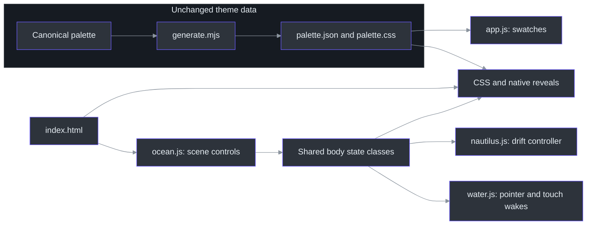
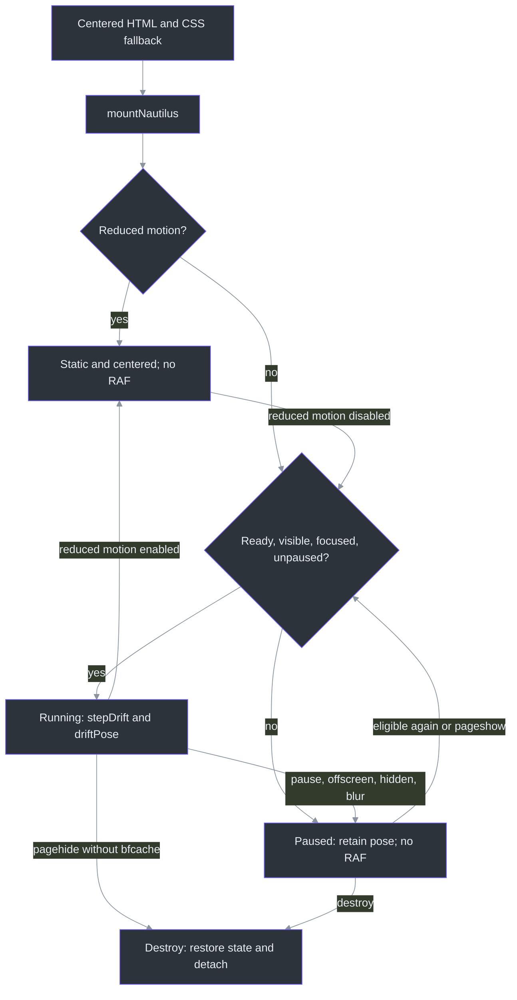

# DeepSeaFoam showcase

## Overview: atmosphere without changing the theme

The showcase makes the workspace hierarchy tangible before asking visitors to choose an application. It is a progressively enhanced static site, not an application screenshot or a new palette release. The HTML/CSS workspace study and exact palette remain separate from decorative scenery. The package version remains **0.4.2**. ([site/index.html:135–199](../site/index.html#L135-L199), [scripts/generate.mjs:700–740](../scripts/generate.mjs#L700-L740), [package.json:3](../package.json#L3))

The hero has no eyebrow. Its four-line poem reads:

> Deep teal water. Quiet light.<br>
> Seafoam signals through the night.<br>
> A little warmth, a clearer view.<br>
> A home for all the work you do.

**Find your app** sits beside **Explore the palette**, using the existing document green `#45D072` with dark text. These are navigation choices, not new theme colors. ([site/index.html:103–130](../site/index.html#L103-L130), `.button-applications`, [site/styles.css:299–312](../site/styles.css#L299-L312), [site/palette.css:11](../site/palette.css#L11))

The reading path is **hero/workspace → nautilus → surface hierarchy → editorial rationale → palette → applications → interaction study → anglerfish → download → footer/blobfish**. Applications immediately follow the palette. The old four principle cards, four-item signal legend, and heritage/extension block are retired from the page; the research narrative and interaction study remain. Creature placement is composition, not biological depth ordering, and the 0–2,000 m gauge is explicitly narrative. ([site/index.html:203–485](../site/index.html#L203-L485), [scripts/validate-site.mjs:145–156](../scripts/validate-site.mjs#L145-L156), `updateScene`, [site/ocean.js:65–82](../site/ocean.js#L65-L82))

## Architecture



The modules load independently from HTML; shared body classes coordinate motion rather than making palette loading a prerequisite. The diagram shows that state contract, not a JavaScript import chain. ([site/index.html:14-22](../site/index.html#L14-L22), `syncMotion`, [site/ocean.js:96-108](../site/ocean.js#L96-L108), `mountNautilus`, [site/nautilus.js:166-170](../site/nautilus.js#L166-L170), `mountWater`, [site/water.js:113-115](../site/water.js#L113-L115))

### Components

| Component | Responsibility and source |
| --- | --- |
| Palette generation | `sitePalette` includes the three core groups; CSS also exposes the extension variables used by studies. Do not hand-edit generated assets. ([scripts/generate.mjs:700–740](../scripts/generate.mjs#L700-L740)) |
| Palette UI | `loadPalette` fetches local JSON; `renderPalette` creates accessible copy buttons. Failure displays a README fallback; `copyValue` has a clipboard fallback. ([site/app.js:10–108](../site/app.js#L10-L108)) |
| Scene controls | `dive`, `finishDive`, `syncMotion`, and `updateScene` own the intro, pause state, narrative depth, and bubble emissions. ([site/ocean.js:21–106](../site/ocean.js#L21-L106)) |
| Interactive water | `WaterField.wake` models directional pressure; `tap` creates a smooth depression and displaced rim. Both propagate through the same damped field. `mountWater` renders local-light refraction behind content. This is stylized, not fluid-accuracy validation. ([site/water.js:24-90](../site/water.js#L24-L90), [site/water.js:136-211](../site/water.js#L136-L211)) |
| Nautilus | Pure model functions choose drift legs; `mountNautilus` owns one animation frame loop, observers, and cleanup. ([site/nautilus.js:35–117](../site/nautilus.js#L35-L117), [site/nautilus.js:127–294](../site/nautilus.js#L127-L294)) |
| Creature reveals | Native checkboxes and CSS reveal/retract the angler and footer blobfish; no disclosure script or expanding card is required. ([site/index.html:380–413](../site/index.html#L380-L413), [site/index.html:453–484](../site/index.html#L453-L484), [site/ocean.css:328–361](../site/ocean.css#L328-L361)) |

## Data flow and interaction lifecycle

The nautilus starts in a centered CSS fallback. Missing JavaScript or unsupported animation APIs never require hiding it. Reduced motion restores that centered fallback; ordinary pause instead preserves the current pose. Resuming resets the frame clock so suspended time is not replayed. ([site/ocean.css:322–327](../site/ocean.css#L322-L327), `mountNautilus` / `sync`, [site/nautilus.js:127–212](../site/nautilus.js#L127-L212))



`blocked` also handles collapsed bounds and shared `page-hidden` state. Intersection/resize observers are event-driven, with scroll/resize fallbacks. Persisted page navigation suspends the controller for back/forward-cache restoration; non-persisted departure destroys it. ([site/nautilus.js:159–175](../site/nautilus.js#L159-L175), [site/nautilus.js:215–294](../site/nautilus.js#L215-L294))

The other effects have separate lifecycles:

- **Intro and bubbles:** skip, Escape, Tab, navigation, pressing, and scrolling bypass the intro. A primary `pointerdown` emits at the contact point before finger release; subsequent compatibility clicks do not emit again. Scroll emissions use the visual viewport's bottom, are frame-coalesced/rate-limited, and share a 64-node cap. Pause, reduced motion, hiding, and departure clear them. (`finishDive`, `bubblesAt`, `updateScene`, [site/ocean.js:23-108](../site/ocean.js#L23-L108), [site/ocean.js:120-174](../site/ocean.js#L120-L174))
- **Water:** fine-pointer mouse/pen movement and single-finger touch gestures create disturbances. `touchstart` injects a tap; passive `touchmove` continues directional wakes after native scrolling causes `pointercancel`. No pointer capture, `preventDefault`, or restrictive touch-action is needed. Multi-touch and cancelled contacts stop tracking; browser-chrome resizes reanchor the active contact rather than inventing a long stroke. Pause, reduced motion, blur, hiding, and navigation clear the field; rendering stops once it settles. (`startTouch`, `moveTouch`, `resize`, [site/water.js:113-134](../site/water.js#L113-L134), [site/water.js:187-307](../site/water.js#L187-L307))
- **Native reveals:** click/tap or Space on the focused checkbox toggles each creature. Hover/focus alone does not reveal the angler. Blobfish kelp parts outward and the image rises within a fixed-height, responsive hideout; unchecking retracts it without changing section height. These controls work without JavaScript; reduced motion suppresses transitions rather than removing the controls. ([site/index.html:382–384](../site/index.html#L382-L384), [site/index.html:453–484](../site/index.html#L453-L484), [site/ocean.css:328–361](../site/ocean.css#L328-L361), [site/styles.css:1724–1735](../site/styles.css#L1724-L1735))

The footer cover uses **20 instances of the same kelp SVG**, each sized with `width: clamp(200px, 40%, 336px)` and its natural aspect ratio. The fish itself has no CSS opacity reduction or filter, preserving its painted colors rather than dimming it to simulate concealment. When changing responsive sizes, inspect the whole sway cycle: a frond count alone does not establish concealment. ([site/index.html:460-479](../site/index.html#L460-L479), `.blobfish` / `.cover-kelp`, [site/ocean.css:331-350](../site/ocean.css#L331-L350))

## Implementation details

### Nautilus: reproducible randomness, continuous motion

`chooseLeg` samples **4–10 seconds** and **10–28 CSS-pixel/s target speeds**; these are model targets, not constant measured screen speeds. Its seeded choices can repeat a direction, while edge handling requests an inward turn. `stepDrift` uses a critically damped velocity filter; `driftPose` applies soft `tanh` confinement and bounded bob/rotation. There is no positional wraparound or mandatory left/right alternation. The pure model is repeatable for a fixed seed; browser mounting supplies a fresh seed. ([site/nautilus.js:26–104](../site/nautilus.js#L26-L104), [site/nautilus.js:148–153](../site/nautilus.js#L148-L153))

Conceptually, preserving the implementation's separation:

```text
state = createDrift(dimensions, seed)
on eligible animation frame:
    state = stepDrift(state, elapsed)   // at most 50 ms; discard long-frame backlog
    pose = driftPose(state)            // smooth bounded position and rotation
    render pose                       // no per-frame layout measurement
on pause: cancel frame; reset clock; keep pose
on reduced motion: reset model; restore centered CSS transform
```

The frame limit and render path are explicit, and resize remaps the existing pose into new bounds rather than adding another loop. ([site/nautilus.js:58–65](../site/nautilus.js#L58-L65), `resizeDrift`, [site/nautilus.js:107–117](../site/nautilus.js#L107-L117), [site/nautilus.js:177–220](../site/nautilus.js#L177-L220))

### Artwork pipeline and shared branding

The footer blobfish is **user-supplied artwork whose original artist and license were not supplied**. Do not label all showcase artwork original or infer a blanket redistribution license. The input already had transparency; this is cleanup and conversion, not invented background removal or repainting. The private source is not distributed; reproducing the derivative requires that source, not just its recorded hash. ([site/artwork-NOTICE.txt:1–8](../site/artwork-NOTICE.txt#L1-L8), [docs/showcase-artwork.json:3–9](showcase-artwork.json#L3-L9))

The optional Pillow tool's `main` validates a distinct, transparent RGBA input, retains the center-connected foreground and soft fringe, removes detached specks, crops with padding, resizes with Lanczos, and encodes WebP. It prints hashes, dimensions, crop, quality, and byte size for comparison with metadata. The recorded derivative is **640×345, quality 82, 43,364 bytes**. Pillow is an offline preparation dependency, not a browser dependency. ([scripts/prepare-blobfish.py:8–52](../scripts/prepare-blobfish.py#L8-L52), [docs/showcase-artwork.json:10–15](showcase-artwork.json#L10-L15))

With `$sourcePng` set to the privately retained PNG path and Pillow already available:

```powershell
python scripts\prepare-blobfish.py "$sourcePng" site\blobfish.webp --width 640 --quality 82
```

The shared `mark.svg` paints **18 lower-half foam circles and five reflection paths** after the seaweed. HTML and webmanifest references use `seaweed-foam-cluster`; the same mark supplies header, footer, study, favicon, and web-app icon. Background scenery has ten kelp clusters plus two foreground edge clusters; the footer hideout has its own twenty-cluster cover. Product marks have separate notices, not the blobfish's provenance. ([site/mark.svg:4–34](../site/mark.svg#L4-L34), [site/index.html:14–15](../site/index.html#L14-L15), [site/index.html:44–67](../site/index.html#L44-L67), [site/index.html:438–479](../site/index.html#L438-L479), [site/site.webmanifest:9–14](../site/site.webmanifest#L9-L14), [site/icons/NOTICE.txt](../site/icons/NOTICE.txt))

### Validation and publication boundaries

`npm test` includes generated freshness, the static-site validator, and the ocean, water, color, and nautilus suites. The nautilus suite defines **18 tests**, covering model determinism/continuity, pause, reduced motion, visibility, resize, fallback APIs, and cleanup. These are source-level test contracts, not a claim that a particular deployed revision passed browser validation. ([package.json:8](../package.json#L8), [scripts/test-nautilus.mjs:12–43](../scripts/test-nautilus.mjs#L12-L43), [scripts/test-nautilus.mjs:280–421](../scripts/test-nautilus.mjs#L280-L421))

The site cap is **200 KiB across every deployed file**, counted recursively, including the transparent illustration, drift module, product icons and notices. No assets are excluded to meet the cap. Validation checks the blobfish's recorded hash, byte size, alpha format and dimensions, required controls, section order, and research links. It does not prove visual kelp occlusion or comfort: browser checks must cover narrow/wide layouts, both checkbox states, keyboard focus, no-JavaScript/reduced-motion behavior, and motion pause/resume. ([scripts/validate-site.mjs:93-170](../scripts/validate-site.mjs#L93-L170), `listAssets`, [scripts/validate-site.mjs:203-224](../scripts/validate-site.mjs#L203-L224))

The `main` Pages workflow validates and uploads only `site`. Release packaging separately snapshots the site into a versioned bundle. **The live showcase may advance independently of the immutable v0.4.2 source bundle**; do not bump the unchanged palette or replace published artifacts for website-only refinements. ([.github/workflows/pages.yml:3–7](../.github/workflows/pages.yml#L3-L7), [.github/workflows/pages.yml:30–51](../.github/workflows/pages.yml#L30-L51), [scripts/package-release.ps1:74–87](../scripts/package-release.ps1#L74-L87))

## Research limitations and references

The editorial section presents familiarity and nautical atmosphere as design associations, not shared reactions of every sailor or reader. Its evidence sources have different scopes; none tests DeepSeaFoam. ([site/index.html:265–293](../site/index.html#L265-L293))

| Source | What it supports | What it does not establish |
| --- | --- | --- |
| [Ethan Schoonover, Solarized features (2011)](https://ethanschoonover.com/solarized/#features) | Designer rationale: “Solarized reduces brightness contrast but, unlike many low contrast colorschemes, retains contrasting hues”. | A controlled clinical result or proof that this derivative improves comfort. |
| [MCA, MGN 357 (2007)](https://www.gov.uk/government/publications/mgn-357-night-time-lookout-photocromic-lenses-and-dark-adaptation) | The HTML summary discusses “allowing time for dark adaptation when undertaking lookouts at night.” | A screen-palette experiment, or a recommendation for DeepSeaFoam. This is operational maritime guidance. |
| [Piepenbrock, Mayr, Mund and Buchner (2013), DOI 10.1080/00140139.2013.790485](https://doi.org/10.1080/00140139.2013.790485) ([abstract record](https://pubmed.ncbi.nlm.nih.gov/23654206/)) | The verified abstract reports “A positive polarity advantage was found for both age groups.” The tasks were visual acuity and proofreading; positive polarity means dark text on a light background. | Universal comfort or eye-health benefits for either polarity. **Full text was not reviewed.** |
| [W3C, WCAG 2.2 Understanding 1.4.3](https://www.w3.org/WAI/WCAG22/Understanding/contrast-minimum.html) | Standards guidance on text/background contrast, including the ordinary-text 4.5:1 threshold and relevant exceptions. | Medical research, a whole-site accessibility audit, or a guarantee of personal comfort. |

Keep these qualifications with the citations. Preference, lighting, task performance, and accessibility conformance are different questions; the showcase makes no universal comfort or health claim.
