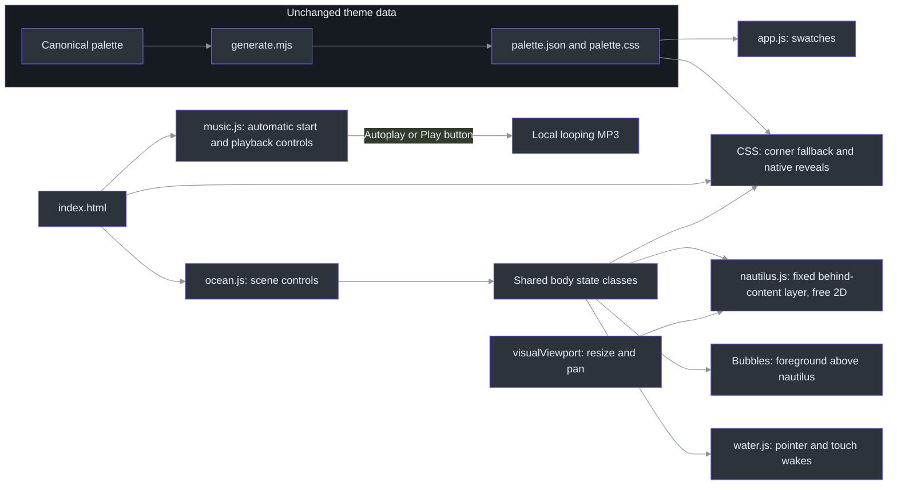
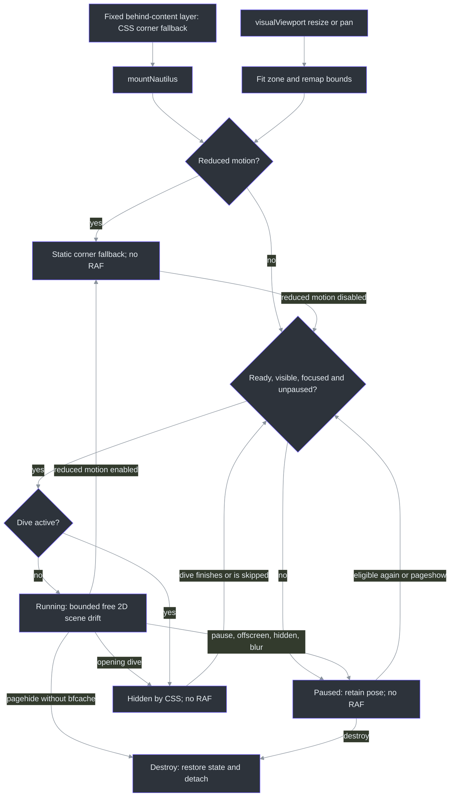

# DeepSeaFoam showcase

## Overview: atmosphere without changing the theme

The showcase makes the workspace hierarchy tangible before asking visitors to choose an application. It is a progressively enhanced static site, not an application screenshot. The HTML/CSS workspace study and exact palette remain separate from decorative scenery. Package **0.5.0** expands the collection from five to **twelve application targets without changing palette colors**; twelve targets does not mean twelve native importers. **0.5.1** adds scoped theme/code licensing and manual-publication preparation, not a new palette. This page documents implementation behavior; release/deployment receipts and installed-application validation are separate concerns. ([site/index.html:152–224](../site/index.html#L152-L224), [site/index.html:327–398](../site/index.html#L327-L398), [scripts/generate.mjs:716–756](../scripts/generate.mjs#L716-L756), [README.md:19–21](../README.md#L19-L21), [package.json:3](../package.json#L3))

The hero has no eyebrow. Its four-line poem reads:

> Deep teal water. Quiet light.<br>
> Seafoam signals through the night.<br>
> A little warmth, a clearer view.<br>
> A home for all the work you do.

**Find your app** sits beside **Explore the palette**, using the existing document green `#45D072` with dark text. These are navigation choices, not new theme colors. ([site/index.html:134–150](../site/index.html#L134-L150), `.button-applications`, [site/styles.css:299–306](../site/styles.css#L299-L306), [site/palette.css:11](../site/palette.css#L11))

The reading path is **hero/workspace → surface hierarchy → editorial rationale/photo reference → palette → applications → interaction study → anglerfish → download → footer/blobfish**. Applications immediately follow the palette. The nautilus is no longer an inline section or spacer: it occupies a root-level scene layer independently of document flow, above the ocean but below readable content. The old four principle cards, four-item signal legend, and heritage/extension block are retired from the page; the research narrative and interaction study remain. Creature placement is composition, not biological depth ordering, and the 0–2,000 m gauge is explicitly narrative. ([site/index.html:70–86](../site/index.html#L70-L86), [site/index.html:228–327](../site/index.html#L228-L327), [site/index.html:400–534](../site/index.html#L400-L534), [scripts/validate-site.mjs:181–202](../scripts/validate-site.mjs#L181-L202), `updateScene`, [site/ocean.js:65–82](../site/ocean.js#L65-L82))

## Architecture



The modules load independently from HTML; shared body classes coordinate motion rather than making palette loading a prerequisite. Music is an independent controller that attempts autoplay on initial visible page loads, not a side effect of motion, scrolling or the intro. The diagram shows that state contract, not a JavaScript import chain. ([site/index.html:16–23](../site/index.html#L16-L23), `syncMotion`, [site/ocean.js:96–108](../site/ocean.js#L96-L108), `mountNautilus` / `blocked`, [site/nautilus.js:209–213](../site/nautilus.js#L209-L213), `mountWater`, [site/water.js:113–115](../site/water.js#L113-L115))

The nautilus zone is **fixed, `aria-hidden`, and pointer-transparent across the full viewport**, outside `main`. It uses `z-index: 1`, above the ocean world at `0` but below `main` and `footer` at `2`; the fish therefore keeps its full roaming area without painting over text or controls. Foreground kelp and bubbles remain above it at `4` and `6`. During the opening dive, `.is-diving` hides the nautilus zone and its controller suspends motion. ([site/index.html:70–91](../site/index.html#L70-L91), [site/ocean.css:1–16](../site/ocean.css#L1-L16), [site/ocean.css:109–140](../site/ocean.css#L109-L140), [site/ocean.css:335–346](../site/ocean.css#L335-L346), [site/nautilus.js:210–214](../site/nautilus.js#L210-L214))

### Components

| Component | Responsibility and source |
| --- | --- |
| Palette generation | `sitePalette` includes the three core groups; CSS also exposes the extension variables used by studies. The generator imports `addChatThemes` and `addDesktopThemes` and passes the shared `exportContext` to both, keeping exports tied to canonical roles. Do not hand-edit generated assets. ([scripts/generate.mjs:1–22](../scripts/generate.mjs#L1-L22), [scripts/generate.mjs:684–686](../scripts/generate.mjs#L684-L686), [scripts/generate.mjs:716–756](../scripts/generate.mjs#L716-L756)) |
| Palette UI | `loadPalette` fetches local JSON; `renderPalette` creates accessible copy buttons. Failure displays a README fallback; `copyValue` has a clipboard fallback. ([site/app.js:10–108](../site/app.js#L10-L108)) |
| Scene controls | `dive`, `finishDive`, `syncMotion`, and `updateScene` own the intro, pause state, narrative depth, and bubble emissions. ([site/ocean.js:21–108](../site/ocean.js#L21-L108)) |
| Background music | `mountMusic` attempts automatic startup, falls back to Play when browser policy blocks it, and manages pending-play cancellation, real media events, visible retry/status and lifecycle pauses. It does not observe or modify motion state. ([site/music.js](../site/music.js), [scripts/test-music.mjs](../scripts/test-music.mjs)) |
| Interactive water | `WaterField.wake` models directional pressure; `tap` creates a smooth depression and displaced rim. Both propagate through the same damped field. `mountWater` renders local-light refraction behind content. This is stylized, not fluid-accuracy validation. ([site/water.js:24–90](../site/water.js#L24-L90), [site/water.js:140–215](../site/water.js#L140-L215), [site/index.html:28–63](../site/index.html#L28-L63), [site/ocean.css:1–16](../site/ocean.css#L1-L16)) |
| Nautilus | Pure model functions choose two-axis drift legs; `mountNautilus` owns one animation frame loop, visual-viewport fitting, observers, and cleanup. ([site/nautilus.js:38–149](../site/nautilus.js#L38-L149), [site/nautilus.js:158–342](../site/nautilus.js#L158-L342)) |
| Application gallery | Twelve source-linked cards describe app-specific support, with local decorative product marks. These are export links, not screenshots or proof of native import compatibility. ([site/index.html:327–398](../site/index.html#L327-L398), [site/styles.css:1210–1255](../site/styles.css#L1210-L1255)) |
| Creature reveals | Native checkboxes and CSS reveal/retract the angler and footer blobfish; no disclosure script or expanding card is required. ([site/index.html:430–463](../site/index.html#L430-L463), [site/index.html:503–534](../site/index.html#L503-L534), [site/ocean.css:346–384](../site/ocean.css#L346-L384)) |

## Data flow and interaction lifecycle

The no-JavaScript fallback parks the nautilus near the **lower-right corner** (`left: 80%; top: 75%`, with smaller maximum dimensions), beneath readable content rather than in front of it. Unsupported animation APIs leave that fallback intact. Reduced motion removes the inline motion transform and selects the same static corner state; ordinary pause instead freezes the current swimming pose. With an unchanged viewport, scrolling the document does not move that paused scene-layer location. Eligible animation starts from the centered model, and resuming resets the frame clock so suspended time is not replayed. ([site/ocean.css:335–346](../site/ocean.css#L335-L346), `createDrift`, [site/nautilus.js:54–65](../site/nautilus.js#L54-L65), `mountNautilus` / `sync`, [site/nautilus.js:159–174](../site/nautilus.js#L159-L174), [site/nautilus.js:216–256](../site/nautilus.js#L216-L256))



`blocked` also handles collapsed bounds and shared `page-hidden` state. Intersection/resize observers are event-driven, with scroll/resize fallbacks. Persisted page navigation suspends the controller for back/forward-cache restoration; non-persisted departure destroys it. Cleanup restores the original transform, state attribute, and zone sizing, and detaches viewport listeners as well as the other observers/listeners. ([site/nautilus.js:202–218](../site/nautilus.js#L202-L218), [site/nautilus.js:258–342](../site/nautilus.js#L258-L342))

`fitViewport` uses native `visualViewport.width`, `height`, `offsetLeft`, and `offsetTop`. Its resize and scroll events refit the fixed zone when browser chrome, pinch zoom, or visual-viewport panning changes the visible rectangle; no zoom gesture is intercepted. Window resize remains a fallback when `visualViewport` is unavailable. Responsive SVG dimensions and rotated-rectangle margins keep the fish inside that zone. A shrinking viewport can require repositioning into smaller bounds, including while paused; this is distinct from a swimming turn, which preserves continuous position, velocity, and acceleration. ([site/nautilus.js:11–26](../site/nautilus.js#L11-L26), `resizeDrift`, [site/nautilus.js:134–149](../site/nautilus.js#L134-L149), [site/nautilus.js:179–196](../site/nautilus.js#L179-L196), [site/nautilus.js:258–282](../site/nautilus.js#L258-L282), [site/ocean.css:336–343](../site/ocean.css#L336-L343))

The other effects have separate lifecycles:

- **Intro and bubbles:** skip, Escape, Tab, navigation, pressing, and scrolling bypass the intro. A primary `pointerdown` emits at the contact point before finger release; subsequent compatibility clicks do not emit again. Scroll emissions use the visual viewport's bottom, are frame-coalesced/rate-limited, and share a 64-node cap. Pause, reduced motion, hiding, and departure clear them. (`finishDive`, `bubblesAt`, `updateScene`, [site/ocean.js:23–108](../site/ocean.js#L23-L108), [site/ocean.js:110–174](../site/ocean.js#L110-L174))
- **Water:** fine-pointer mouse/pen movement and single-finger touch gestures create disturbances. `touchstart` injects a tap; passive `touchmove` continues directional wakes after native scrolling causes `pointercancel`. No pointer capture, `preventDefault`, or restrictive touch-action is needed. Multi-touch and cancelled contacts stop tracking; browser-chrome resizes reanchor the active contact rather than inventing a long stroke. Pause, reduced motion, blur, hiding, and navigation clear the field; rendering stops once it settles. (`startTouch`, `moveTouch`, `resize`, [site/water.js:113–138](../site/water.js#L113-L138), [site/water.js:191–309](../site/water.js#L191-L309))
- **Native reveals:** click/tap or Space on the focused checkbox toggles each creature. Hover/focus alone does not reveal the angler. Blobfish kelp parts outward and the image rises within a fixed-height, responsive hideout; unchecking retracts it without changing section height. These controls work without JavaScript; reduced motion suppresses transitions rather than removing the controls. ([site/index.html:430–434](../site/index.html#L430-L434), [site/index.html:503–534](../site/index.html#L503-L534), [site/ocean.css:346–384](../site/ocean.css#L346-L384), [site/styles.css:1709–1726](../site/styles.css#L1709-L1726))

The footer cover uses **20 instances of the same kelp SVG**, each sized with `width: clamp(200px, 40%, 336px)` and its natural aspect ratio. The fish itself has no CSS opacity reduction or filter, preserving its painted colors rather than dimming it to simulate concealment. When changing responsive sizes, inspect the whole sway cycle: a frond count alone does not establish concealment. ([site/index.html:510–529](../site/index.html#L510-L529), `.blobfish` / `.cover-kelp`, [site/ocean.css:349–362](../site/ocean.css#L349-L362))

## Implementation details

### Nautilus: free two-axis roaming at threefold nominal speed

`SPEED_MULTIPLIER = 3` raises nominal translation targets from **10–28 to 30–84 CSS pixels per second**, while sampled leg durations remain **4–10 seconds**. Edge handling may request a new inward leg sooner. These are targets, not constant measured screen speeds: damping eases into motion, normalized rates are capped, and soft confinement slows travel near an edge. The threefold change also scales the normalized rate limit; it does not triple leg timing or guarantee every rendered displacement is exactly three times its predecessor. ([site/nautilus.js:1–9](../site/nautilus.js#L1-L9), `chooseLeg` / `stepDrift`, [site/nautilus.js:38–50](../site/nautilus.js#L38-L50), [site/nautilus.js:81–115](../site/nautilus.js#L81-L115), [scripts/test-nautilus.mjs:54–64](../scripts/test-nautilus.mjs#L54-L64))

`chooseLeg` samples an angle over the full circle, giving left/right, up/down, and diagonal travel; successive legs may repeat a quadrant. Each axis retains its own position, velocity, and acceleration. `advanceAxis` applies the exact critically damped velocity filter separately to both axes, and `axisPose` applies soft `tanh` confinement to both positions. Vertical motion is genuine roaming, no longer a small periodic bob. `driftPose` retains only a small bounded decorative rotation. There is no positional wrapping, teleporting on turns, or mandatory left/right alternation. The pure model is repeatable for a fixed seed; browser mounting supplies a fresh seed. ([site/nautilus.js:29–132](../site/nautilus.js#L29-L132), [site/nautilus.js:190–196](../site/nautilus.js#L190-L196), [scripts/test-nautilus.mjs:25–51](../scripts/test-nautilus.mjs#L25-L51), [scripts/test-nautilus.mjs:109–140](../scripts/test-nautilus.mjs#L109-L140))

Conceptually, preserving the implementation's separation:

```text
state = createDrift(dimensions, seed)
on eligible animation frame:
    state = stepDrift(state, elapsed)   // at most 50 ms; discard long-frame backlog
    pose = driftPose(state)            // independently bounded x/y plus small rotation
    render pose                       // no per-frame layout measurement
on pause: cancel frame; reset clock; keep pose
on reduced motion: reset model; remove inline transform; use CSS corner fallback
on visual viewport resize or pan: fit zone; remap model to the available bounds
```

The frame limit and render path are explicit, and resize remaps the existing pose into new bounds rather than adding another loop. Turn-continuity tests reduce the time step and require position, velocity, and acceleration changes to converge toward zero; acceleration need not be identical across a finite interval because jerk is finite. ([site/nautilus.js:81–105](../site/nautilus.js#L81-L105), `resizeDrift`, [site/nautilus.js:134–149](../site/nautilus.js#L134-L149), [site/nautilus.js:220–265](../site/nautilus.js#L220-L265), [scripts/test-nautilus.mjs:109–153](../scripts/test-nautilus.mjs#L109-L153))

### Application gallery: twelve targets, different support boundaries

The five existing cards—Visual Studio Code, Visual Studio, Obsidian, Windows Terminal, and Firefox—are joined by seven app-specific entries. Every card links to its target's repository directory and uses a locally hosted SVG with empty alternate text, fixed 48-pixel dimensions, and native lazy loading; the adjacent heading supplies the product name. The gallery uses three equal columns on wider layouts and one column at the narrow-layout breakpoint. Product marks identify their owners' applications, not an endorsement or an installed-app screenshot. ([site/index.html:337–396](../site/index.html#L337-L396), `.application-grid` / `.app-card-top img`, [site/styles.css:1210–1255](../site/styles.css#L1210-L1255), [site/styles.css:1556–1558](../site/styles.css#L1556-L1558), [site/icons/NOTICE.txt:1–14](../site/icons/NOTICE.txt#L1-L14))

| Added target | Format and limitation shown by the gallery |
| --- | --- |
| Discord | Optional unofficial custom CSS for modified clients, **not a native Discord import**. ([site/index.html:362–366](../site/index.html#L362-L366)) |
| Telegram Desktop | Native desktop theme format for chat/navigation/control surfaces; the target is Telegram Desktop, not a claim about every Telegram client. ([site/index.html:367–371](../site/index.html#L367-L371)) |
| Slack | Limited native four-color preset, not whole-client CSS; Slack controls the remaining surfaces. The gallery deliberately labels this a preset rather than full-client theming. ([site/index.html:372–376](../site/index.html#L372-L376)) |
| Chromium / Chrome and Edge | Browser-theme manifest for browser-owned chrome, without website CSS, scripts, or permissions. ([site/index.html:377–381](../site/index.html#L377-L381)) |
| JetBrains IDEs | Theme-only plugin containing IDE and editor colors. ([site/index.html:382–386](../site/index.html#L382-L386)) |
| Sublime Text | Editor/syntax color scheme paired with the built-in Adaptive UI, not a standalone complete UI theme. ([site/index.html:387–391](../site/index.html#L387-L391)) |
| Alacritty | TOML colors using the existing higher-contrast terminal palette. ([site/index.html:392–396](../site/index.html#L392-L396)) |

The gallery's support descriptions must stay distinct from actual host-version compatibility tests and installation. Source packaging alone does not establish either. Icon provenance is also separate from theme support: the seven new marks add SVG Logos and Alacritty notices alongside the existing upstream notices; the validator checks all twelve original SVG hashes and rejects active/external SVG references. ([site/icons/NOTICE.txt:4–14](../site/icons/NOTICE.txt#L4-L14), [scripts/validate-site.mjs:50–80](../scripts/validate-site.mjs#L50-L80))

### Photographic inspiration: an attributed external reference

The linked inspiration is **[Bay with Orange Seashore Under White and Gray Clouds](https://www.pexels.com/photo/bay-with-orange-seashore-under-white-and-gray-clouds-8567869/)**, Pexels photo **8567869**, by **[JJ Perks](https://www.pexels.com/@jj-perks-868548/)**. The metadata records the **[original 7952 × 5304 JPEG](https://images.pexels.com/photos/8567869/pexels-photo-8567869.jpeg)**, the [Pexels license](https://www.pexels.com/license/), and its photo-page JSON-LD evidence. It is a project-owner-named visual inspiration, not a claim that palette values were sampled from its pixels. ([docs/showcase-artwork.json:17–27](showcase-artwork.json#L17-L27))

Only text links appear in the editorial section, with a footer jump to that section. **The photograph is never automatically fetched or bundled with the showcase**: following the source/original links is an explicit external navigation. The validator checks the three reference links and original dimensions and prohibits external `img`/`source` loading; stylesheet and script checks separately prohibit external runtime assets. ([site/index.html:283–289](../site/index.html#L283-L289), [site/index.html:494–496](../site/index.html#L494-L496), [scripts/validate-site.mjs:108–116](../scripts/validate-site.mjs#L108-L116), [scripts/validate-site.mjs:226–232](../scripts/validate-site.mjs#L226-L232))

### Default background music

The owner supplied a **176-second, stereo, 48 kHz, 16-bit PCM WAV**. The complete recording is encoded as **128 kbps MP3, 2,817,068 bytes**, with metadata removed and no trimming, gain, speed or pitch changes. The original WAV is not committed. A small standard-library Python wrapper invokes an existing FFmpeg/libmp3lame encoder, refuses to overwrite either the source or an existing output, and reports source/output hashes and metadata. Reproduction needs the private source and an encoder; neither is a browser dependency. ([scripts/prepare-music.py](../scripts/prepare-music.py), [docs/showcase-artwork.json](showcase-artwork.json))

```powershell
python scripts\prepare-music.py "$sourceWav" site\audio\deepseafoam-music.mp3 --ffmpeg "$ffmpeg"
```

`music.js` is independent of the ocean controller. Its HTML audio element has
`preload="none"` and **no initial `src`** in markup, leaving startup under the
controller's control. On a fresh visible page load, the controller assigns
`data-src` and attempts audible playback at the user's request. A browser-policy
`NotAllowedError` leaves **Play music** with an explanation, not a media-error
warning or a repeated autoplay attempt. An explicit button activation calls
`play()` before awaiting, preserving mobile gesture eligibility.
**Play music / Cancel music / Pause music / Retry music** reflect actual playback
or a pending request. A persistent live region announces loading, blocked
autoplay and errors. Loading remains cancellable, and stale play promises cannot
restart paused music or cancel a newer request. ([site/music.js](../site/music.js))

Pause preserves playback position. `visibilitychange` to hidden and `pagehide`
pause music; returning does not resume it automatically. A `back_forward`
navigation also skips startup when the page is reconstructed without bfcache.
Initially hidden pages stay paused. Fresh navigation and reload attempt playback;
there is no preference storage, Web Audio graph, muted-autoplay workaround or
coupling to Pause motion/reduced motion. The source loops while playing. Element
volume starts at 0.35 where the browser permits it; iOS may keep volume under
hardware control. The no-JavaScript fallback is a direct MP3 link.

Controls use a shared fixed dock with 44px minimum targets and safe-area offsets.
The skip action and live status sit above the dock rather than shifting its
buttons during intro completion or network loading. The music file counts toward
the all-assets budget, and browser acceptance must cover both allowed and blocked
autoplay, real keyboard/touch decoding/playback, looping, retry, navigation pauses
and narrow/no-JavaScript layouts. No-JavaScript mode does not request audio until
the visitor follows its direct link.

The user supplied the recording for website playback, but its original artist
and redistribution license were not supplied. Do not infer that the music is
original to this project, royalty-free or covered by the theme/code MIT grant.
Preserve its separate notice and hashes. ([site/artwork-NOTICE.txt](../site/artwork-NOTICE.txt))

### Blobfish preparation and shared branding

The footer blobfish is **user-supplied artwork whose original artist and license were not supplied**. Do not label all showcase artwork original or infer a blanket redistribution license. The input already had transparency; this is cleanup and conversion, not invented background removal or repainting. The private source is not distributed; reproducing the derivative requires that source, not just its recorded hash. ([site/artwork-NOTICE.txt:1–8](../site/artwork-NOTICE.txt#L1-L8), [docs/showcase-artwork.json:3–9](showcase-artwork.json#L3-L9))

The optional Pillow tool's `main` validates a distinct, transparent RGBA input, retains the center-connected foreground and soft fringe, removes detached specks, crops with padding, resizes with Lanczos, and encodes WebP. It prints hashes, dimensions, crop, quality, and byte size for comparison with metadata. The recorded derivative is **640×345, quality 82, 43,364 bytes**. Pillow is an offline preparation dependency, not a browser dependency. ([scripts/prepare-blobfish.py:8–52](../scripts/prepare-blobfish.py#L8-L52), [docs/showcase-artwork.json:10–15](showcase-artwork.json#L10-L15))

With `$sourcePng` set to the privately retained PNG path and Pillow already available:

```powershell
python scripts\prepare-blobfish.py "$sourcePng" site\blobfish.webp --width 640 --quality 82
```

The shared `mark.svg` paints **18 lower-half foam circles and five reflection paths** after the seaweed. HTML and webmanifest references use `seaweed-foam-cluster`; the same mark supplies header, footer, study, favicon, and web-app icon. Background scenery has ten kelp clusters plus two foreground edge clusters; the footer hideout has its own twenty-cluster cover. Product marks have separate notices, not the blobfish's provenance. ([site/mark.svg:4–34](../site/mark.svg#L4-L34), [site/index.html:14–15](../site/index.html#L14-L15), [site/index.html:45–68](../site/index.html#L45-L68), [site/index.html:109–113](../site/index.html#L109-L113), [site/index.html:163–167](../site/index.html#L163-L167), [site/index.html:484–529](../site/index.html#L484-L529), [site/site.webmanifest:9–14](../site/site.webmanifest#L9-L14), [site/icons/NOTICE.txt:1–14](../site/icons/NOTICE.txt#L1-L14))

### Validation and publication boundaries

`npm test` includes generated freshness, the static-site validator, and the ocean, water, color, nautilus, application-target and music suites. The music suite covers automatic startup, policy-blocked fallback, hidden/history initialization, trusted-control flow, cancellation races, retryable failures, media events, lifecycle pauses and teardown. The nautilus suite defines **20 tests**, covering seeded two-axis travel, the exact threefold pre-confinement speed relationship, bounded/continuous turns, pause, reduced motion, visibility, resize, visual-viewport resize/pan handling, fallback APIs, and cleanup. These are source-level test contracts, not a claim that a particular deployed revision passed browser validation. ([package.json:8](../package.json#L8), [scripts/test-nautilus.mjs:12–188](../scripts/test-nautilus.mjs#L12-L188), [scripts/test-nautilus.mjs:279–500](../scripts/test-nautilus.mjs#L279-L500))

The site cap is now **3 MiB across every deployed file**, increased specifically for the user-requested music. An additional **256 KiB non-audio cap** preserves the earlier lightweight page boundary; the 2,817,068-byte MP3 can now load during automatic startup. Counting is recursive and includes the audio, transparent illustration, every module/product SVG/notice, and `.nojekyll`; nothing is omitted from the total cap. The linked-only Pexels photograph is not a deployed asset. ([site/icons/NOTICE.txt:4–14](../site/icons/NOTICE.txt#L4-L14), `listAssets` / `totalBytes` / `budget`, [scripts/validate-site.mjs:245–268](../scripts/validate-site.mjs#L245-L268))

Validation checks the twelve-card inventory and icon hashes, blobfish hash/size/alpha/dimensions, photo attribution links, required controls, section order, behind-content layering contract, and research limits. It does not prove visual kelp occlusion, installed-app compatibility, or comfort. Browser acceptance must additionally cover wide/narrow viewports; seeded left/right/up/down/diagonal travel; bounded turns; nautilus paint below reading content with kelp and bubbles above; native click/tap-through; pause remaining fixed during document scroll; intro hiding; no-JavaScript/reduced-motion fallback; and native pinch/visual-viewport containment. Phone emulation is not physical-device or Safari validation. ([scripts/validate-site.mjs:50–116](../scripts/validate-site.mjs#L50-L116), [scripts/validate-site.mjs:154–214](../scripts/validate-site.mjs#L154-L214), [scripts/test-nautilus.mjs:25–140](../scripts/test-nautilus.mjs#L25-L140), [scripts/test-nautilus.mjs:340–414](../scripts/test-nautilus.mjs#L340-L414), [scripts/test-nautilus.mjs:481–500](../scripts/test-nautilus.mjs#L481-L500))

The `main` Pages workflow validates and uploads only `site`. Release packaging separately runs validation and parses the Visual Studio and JetBrains XML, then packages application-specific assets and a versioned source/site bundle with SHA-256 checksums. The packaging additions include chat-target files, a Chromium ZIP, a JetBrains JAR, a Sublime color scheme, and Alacritty TOML. Browser-generated `Cached Theme.pak` files are excluded. **0.5.0 expanded application support; 0.5.1 includes approved MIT notices, a single-file-export license companion and a VS Code manual-upload kit. Neither changes palette colors.** A website deployment and a native release remain separate publication steps; neither is established by this document or by the presence of packaging code. Preserve earlier immutable release assets rather than silently replacing them. ([.github/workflows/pages.yml:3–7](../.github/workflows/pages.yml#L3-L7), [.github/workflows/pages.yml:30–51](../.github/workflows/pages.yml#L30-L51), [scripts/package-release.ps1:26–38](../scripts/package-release.ps1#L26-L38), [scripts/package-release.ps1:65–94](../scripts/package-release.ps1#L65-L94), [scripts/package-release.ps1:109–144](../scripts/package-release.ps1#L109-L144))

## Research limitations and references

The editorial section presents familiarity and nautical atmosphere as design associations, not shared reactions of every sailor or reader. Its evidence sources have different scopes; none tests DeepSeaFoam. The linked photograph is visual inspiration, not scientific evidence or a palette-sampling specification. ([site/index.html:274–308](../site/index.html#L274-L308), [docs/showcase-artwork.json:17–27](showcase-artwork.json#L17-L27))

| Source | What it supports | What it does not establish |
| --- | --- | --- |
| [Ethan Schoonover, Solarized features (2011)](https://ethanschoonover.com/solarized/#features) | Designer rationale: “Solarized reduces brightness contrast but, unlike many low contrast colorschemes, retains contrasting hues”. | A controlled clinical result or proof that this derivative improves comfort. |
| [MCA, MGN 357 (2007)](https://www.gov.uk/government/publications/mgn-357-night-time-lookout-photocromic-lenses-and-dark-adaptation) | The HTML summary discusses “allowing time for dark adaptation when undertaking lookouts at night.” | A screen-palette experiment, or a recommendation for DeepSeaFoam. This is operational maritime guidance. |
| [Piepenbrock, Mayr, Mund and Buchner (2013), DOI 10.1080/00140139.2013.790485](https://doi.org/10.1080/00140139.2013.790485) ([abstract record](https://pubmed.ncbi.nlm.nih.gov/23654206/)) | The verified abstract reports “A positive polarity advantage was found for both age groups.” The tasks were visual acuity and proofreading; positive polarity means dark text on a light background. | Universal comfort or eye-health benefits for either polarity. **Full text was not reviewed.** |
| [W3C, WCAG 2.2 Understanding 1.4.3](https://www.w3.org/WAI/WCAG22/Understanding/contrast-minimum.html) | Standards guidance on text/background contrast, including the ordinary-text 4.5:1 threshold and relevant exceptions. | Medical research, a whole-site accessibility audit, or a guarantee of personal comfort. |

Keep these qualifications with the citations. Preference, lighting, task performance, and accessibility conformance are different questions; the showcase makes no universal comfort or health claim.
