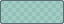
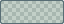
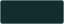
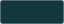
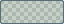
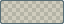
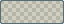
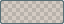
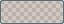

# DeepSeaFoam 0.4.0

Pastel core signals, with the dark workspace and the separate higher-contrast terminal scheme preserved.

## Changed

| Core role | Previous | 0.4.0 |
| --- | --- | --- |
| Accent |  `#2AA198` |  `#78C8C0` pastel seafoam |
| Document indicator |  `#859900` |  `#B2BF84` pastel kelp |
| Warning |  `#B58900` |  `#CEB47C` pastel amber |
| Error |  `#DC322F` |  `#E6A49C` pastel coral |

Each original sRGB color is converted to OKLCH, preserving its hue while setting lightness to **0.78** and chroma to **0.08**, then converted back to in-gamut sRGB and rounded to 8-bit channels. The [canonical palette](../../palette/deepseafoam.json) records the derivation.

- Native semantic mappings and core-backed syntax inherit the pastels, including strings, keywords, numbers, and diagnostics.
- The symmetry guide becomes  `#78C8C088`, retaining alpha `88`.
- Visible core swatches and palette-driven previews follow the revised colors.

## Readability adaptations

- UI text selection becomes  `#78C8C026` (38/255 = **14.90% alpha**), compositing to  `#122B2D` on the base and  `#12373D` on panels. Ordinary  `#93A1A1` text retains at least **4.5:1** contrast on both.
- VS Code incidental selection/word highlights use  `#78C8C01A` (10.20% alpha). Active find fill uses  `#CEB47C26`; other matches use  `#CEB47C1A`, with full-color borders. Invalid-token errors use dark base-colored text on pastel coral.
- Obsidian error surfaces use  `#E6A49C26` and hover  `#E6A49C2E` instead of opaque coral behind warm text. Its HSL/RGB aliases are generated from canonical values.

See [application mappings](../MAPPINGS.md) for role and host boundaries. These selected contrast pairs are not a claim of universal accessibility compliance.

## Unchanged

- The 0.2.0 near-black teal base  `#000F13`, panel  `#001E26`, text/faint text, warm emphasis, light edge, border, preview neutrals, black shadows/backdrop, and grid overlay.
- **All 19 higher-contrast terminal colors**, both terminals'  `#000F13` backgrounds, and Windows Terminal scheme content from 0.3.0.
- The four Solarized heritage syntax extension colors:  `#CB4B16`,  `#D33682`,  `#6C71C4`, and  `#268BD2`. This does **not** freeze syntax roles sourced from the core.
- The core inventory: **11 solids + 8 overlays + 8 preview neutrals = 27 values**.
- SpriteCanvas remains the read-only origin. No export recolors artwork, images, authored document colors, or exported content.

## Package formats

The release packaging workflow produces five application artifacts, a complete bundle, and checksums:

- `DeepSeaFoam-VSCode-0.4.0.vsix` — installable VS Code extension.
- `DeepSeaFoam-Obsidian-0.4.0.zip` — ready-to-copy `DeepSeaFoam` theme folder.
- `DeepSeaFoam-WindowsTerminal-0.4.0.json` — one scheme object, not a complete `settings.json`.
- `DeepSeaFoam-VisualStudio-0.4.0.vstheme` — portable source requiring Color Theme Designer / VSIX packaging for the target Visual Studio version.
- `DeepSeaFoam-Firefox-0.4.0.zip` — unsigned static-theme source; extract it for temporary loading through `about:debugging`. Permanent installation requires Mozilla signing.
- `DeepSeaFoam-0.4.0.zip` — complete palette, documentation, generator, showcase, and application exports.
- `SHA256SUMS.txt` — SHA-256 checksums for the six artifacts above.

Generation, package verification, installation, and real-application validation are separate stages. Exported packages are not proof of runtime validation in all five applications, and no package changes live application settings automatically.
