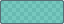
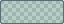
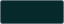
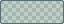
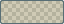
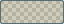
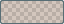
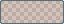

# DeepSeaFoam 0.4.1

Corrects the overly light 0.4.0 palette: bright, saturated signals with pastel softness, rather than pale, chalky, or washed-out colors.

## Color correction

| Core role | 0.4.0 | 0.4.1 |
| --- | --- | --- |
| Accent / seafoam |  `#78C8C0` |  `#28C0B5` |
| Document / kelp |  `#B2BF84` |  `#A0B256` |
| Warning / amber |  `#CEB47C` |  `#C9A244` |
| Error / coral |  `#E6A49C` |  `#E9897E` |

The reproducible OKLCH derivation retains hues from the original 0.3.0 sRGB colors ( `#2AA198`,  `#859900`,  `#B58900`,  `#DC322F`), not the rounded 0.4.0 outputs. Shared lightness/chroma change from **0.78 / 0.08** to **0.73 / 0.12**, followed by conversion to in-gamut sRGB and 8-bit rounding. The result is darker than 0.4.0, much richer in chroma, and still lightened relative to the originals. Seafoam's chroma is slightly higher than its original; this is not uniform desaturation.

Native semantic mappings and core-backed syntax inherit the correction. The symmetry guide becomes  `#28C0B588`, retaining alpha `88`.

## Readability

- UI selection becomes  `#28C0B526` at unchanged **14.90% alpha**, compositing to  `#06292B` on the base and  `#06363B` on panels. Ordinary  `#93A1A1` text has approximately **5.78:1 / 4.91:1** contrast respectively.
- VS Code incidental highlights use  `#28C0B51A`; find fills use  `#C9A24426` /  `#C9A2441A` with full-color borders. Invalid-token text stays  `#000F13` on the revised  `#E9897E` fill.
- Obsidian error surfaces become  `#E9897E26` and hover  `#E9897E2E`; HSL/RGB aliases remain generated from canonical colors.

These selected contrast pairs are not a claim of universal accessibility compliance. See [application mappings](../MAPPINGS.md).

## Unchanged scope and installation

- All seven neutral solids, other overlays, preview neutrals, and four Solarized heritage syntax extension colors remain unchanged. Core-backed syntax is not frozen. The core count remains **27**.
- **All 19 terminal colors, both terminal backgrounds, and Windows Terminal scheme content remain unchanged.**
- SpriteCanvas remains the read-only origin; exports do not recolor user content.
- Packaging retains the five application formats, complete bundle, and SHA-256 checksums. Visual Studio needs host-specific Color Theme Designer / VSIX packaging. Firefox remains unsigned static-theme source; permanent installation requires Mozilla signing.

Generation, packaging, publication, installation, and real-application validation remain separate stages. These notes do not claim completed publication or runtime validation in the five applications. No package changes live settings automatically.
