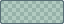
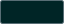
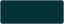
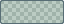
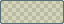
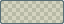
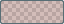
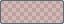

# DeepSeaFoam 0.4.2

Replaces 0.4.1's softened core signals with vivid terminal-style intensity, shaded a little darker and richer. These are not pale or chalky pastels.

## Terminal-derived signals

| Core role | 0.4.1 | Terminal source (unchanged) | Shade scale | 0.4.2 |
| --- | --- | --- | --- | --- |
| Accent / seafoam |  `#28C0B5` | `brightCyan` /  `#00B39E` | 0.94 |  `#00A591` |
| Document / vivid green |  `#A0B256` | `brightGreen` /  `#51EF84` | 0.90 |  `#45D072` |
| Warning / bright yellow |  `#C9A244` | `brightYellow` /  `#FFF96E` | 0.94 |  `#EBE565` |
| Error / vivid rose |  `#E9897E` | `red` /  `#F54F65` | 0.96 |  `#E84A5F` |

Convert each approved terminal source from sRGB to OKLCH, multiply **both lightness and chroma** by the role's scale, preserve hue, then convert back to sRGB and round to 8-bit channels. The nonuniform scales deepen the existing terminal colors without mixing in white/gray or forcing equal lightness/chroma.

The [canonical palette](../../palette/deepseafoam.json) records `signalAdaptation` with `space: "oklch"`, `method: "proportional-shade"`, `sourceGroup: "terminal"`, and each role's source/scale. Native semantic mappings and core-backed syntax inherit the vivid signals. The symmetry guide becomes  `#00A59188`, retaining alpha `88`.

## Readability

- UI selection becomes  `#00A59126` at unchanged **14.90% alpha**, compositing to  `#002526` on the base and  `#003236` on panels. Ordinary  `#93A1A1` text has approximately **6.08:1 / 5.20:1** contrast respectively.
- VS Code incidental highlights use  `#00A5911A`; find fills use  `#EBE56526` /  `#EBE5651A` with full-color borders. Invalid-token text stays  `#000F13` on the revised  `#E84A5F` rose fill.
- Obsidian error surfaces become  `#E84A5F26` and hover  `#E84A5F2E`; HSL/RGB aliases remain generated from canonical colors.

These selected contrast pairs are not a claim of universal accessibility compliance. See [application mappings](../MAPPINGS.md).

## Unchanged scope and installation

- All seven neutral solids, other overlays, preview neutrals, and four Solarized heritage syntax extension colors remain unchanged. Core-backed syntax is not frozen. The core count remains **27**.
- **All 19 terminal colors, both terminal backgrounds, and Windows Terminal scheme content remain unchanged.**
- SpriteCanvas remains the read-only origin; exports do not recolor user content.
- Packaging retains the five application formats, complete bundle, and SHA-256 checksums. Visual Studio needs host-specific Color Theme Designer / VSIX packaging. Firefox remains unsigned static-theme source; permanent installation requires Mozilla signing.

Export and package checks do not establish runtime validation in every application version or extension set. Installation remains separate, and no package changes live settings automatically.
