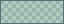

# DeepSeaFoam for Notepad++

Generated from the canonical palette, version **0.7.0**. Do not edit
the generated files. [DeepSeaFoam.xml](DeepSeaFoam.xml) is a native **Style
Configurator theme**, not a User Defined Language or a replacement configuration.
The source-checked support baseline is **Notepad++ 8.9.8 on Windows**. Older
versions are not certified; 8.9+ supplies default foreground/background for
missing language styles rather than inserting the light model's colors.

## Install without replacing settings

If using the versioned release asset, save a copy as `DeepSeaFoam.xml` in a
new download directory first. The theme chooser uses the XML filename; the steps
below assume this canonical name. Back up any same-named installed theme.

1. Record your current theme, Dark Mode/tone, font choices and Global override
   checkboxes. Back up your current theme XML (or `stylers.xml`) and any existing
   `DeepSeaFoam.xml` before replacing that same-named file. Save documents before
   restarting; do not delete session or backup files.
2. Copy only `DeepSeaFoam.xml` into `%APPDATA%\Notepad++\themes\`.
   For portable/local-configuration installs, use `themes\` beside the executable.
   For Cloud or `-settingsDir` configurations, use that active configuration's
   `themes\` directory. Create the directory if missing, but never overwrite
   `config.xml`, `stylers.xml`, `langs.xml` or an unrelated theme.
3. Restart Notepad++, then choose **Settings -> Preferences -> Dark Mode -> Dark
   Mode** if desired. Set the mode first: switching modes can restore a different
   remembered theme. This mode change is optional and separate from the XML.
4. Open **Settings -> Style Configurator -> Select theme -> DeepSeaFoam**, then
   **Save & Close**. Keep your desired font and size; this theme specifies no
   font family or size. It does style comments italic and search headings bold.
   Existing Global override checkboxes can suppress syntax colors: record them
   before optionally disabling their color overrides.

The built-in **Settings -> Import -> Import Style Themes...** is an alternative,
but attempts to copy to the executable's theme directory, which may require
elevation. The per-user copy route above avoids that requirement.

Font, user-defined extensions and custom keyword lists can be **theme-specific**.
The original theme retains your customizations; they are not automatically
merged into this one. Built-in extension/keyword definitions are left to Notepad++.
UDLs and plugin lexers keep their independent color definitions.

## Coverage and deliberate mappings

The export contains all native styles for **22 language lexers plus Search
result**, including separate `javascript.js` (ordinary JS files) and
`javascript` (embedded scripts): Bash, Batch, C, C++, C#, CSS, diff, Go, HTML,
Java, JavaScript, JSON, Makefile, PowerShell, properties, Python, Rust, SQL,
TypeScript, XML and YAML. Plain text uses Global Styles / Default Style.
Unlisted built-in languages receive host fallbacks, not bespoke syntax mappings.
No fictitious Markdown lexer or invented style IDs are included.

| Role | Mapping |
| --- | --- |
| Editor / surrounding gutters | base  `#000F13` / panel  `#001E26` |
| Ordinary / comment / emphasized text |  `#93A1A1` /  `#839496` /  `#EEE8D5` |
| Keywords / strings | document  `#45D072` / accent  `#00A591` |
| Numbers and literal constants | warning  `#EBE565` |
| Types / escapes and markup entities | heritage blue  `#268BD2` / magenta  `#D33682` |
| Operators and attributes / preprocessor and regex | heritage violet  `#6C71C4` / orange  `#CB4B16` |
| Selection / selected foreground |  `#002526` /  `#EEE8D5` |
| Caret / current line / indent and edge guide |  `#FDF6E3` /  `#001E26` /  `#23353A` |
| Saved / modified / invalid or deleted |  `#45D072` /  `#EBE565` /  `#E84A5F` |

Syntax follows the repository's shared editor mappings: document-green keywords,
seafoam strings, warning-yellow numbers/constants, warm functions and blue types.
JSON escapes and HTML/XML entities stay magenta, separate from numeric literals.
JSON boolean/null keywords and YAML boolean keywords are literal constants.
True character/rune literals in C/C++/C#/Java/Go/Rust use the constant color;
single-quoted strings in JavaScript, Python, Bash and PowerShell remain strings.
Search-result file headers and diff command headers retain accent; diff additions
retain document green rather than borrowing the string color.

XML colors are six-digit **RRGGBB without #**, not RGBA. Selection composites
 `#00A59126` over base; search-result hits composite it over
panel ( `#003236`). Indent/edge guides composite the canonical separator.
The host applies its own indicator opacity (100/255 in the checked source) to
smart/find/tag/mark highlights; those styles deliberately contain the uncomposited
signal colors, avoiding a second alpha reduction. Five mark styles and both
light/dark tab-color groups are provided. Tab colors are subtle 15% tints on panel.

Current-line visibility/frame mode, change history, whitespace and search markers
remain governed by your existing preferences. To use the warm selected foreground,
optionally enable **Preferences -> Editing -> Apply custom color to selected text
foreground**. Otherwise Notepad++ preserves syntax foregrounds on the selection.
The XML does not toggle any of these preferences.

## Optional surrounding chrome (manual)

**This XML does not recolor all Notepad++ chrome.** Dark Mode has independent
tones; especially tab text/inactive tab backgrounds in Dark Mode need not follow
their similarly named XML styles. OS-owned file dialogs and plugin UI can differ.
For an optional closer match, record every previous value first, then use
**Preferences -> Dark Mode -> Customized**:

| Native tone control | Suggested color |
| --- | --- |
| Top / Main |  `#001E26` |
| Active |  `#000F13` |
| Menu hot track |  `#003236` |
| Error |  `#23252E` |
| Text / Darker text / Disabled text |  `#93A1A1` /  `#839496` /  `#586E75` |
| Link / Edge highlight |  `#00A591` |
| Edge / Edge disabled |  `#586E75` /  `#233E46` |

These are manual suggestions, not settings applied by the theme. Leave unrelated
preferences, document contents and media untouched.

## Remove / restore

Choose your former theme in Style Configurator. Restore any separately changed
Dark Mode/tone, font, override or Editing options to the values you recorded.
After closing all Notepad++ instances, remove only the installed DeepSeaFoam XML,
or restore its same-named backup. Never delete `stylers.xml` or reset all
preferences to uninstall this theme.

## Source contract and validation limits

Pinned Notepad++ **v8.9.8**, commit `40f896e6f6c49a29b6ca3f559696dd786f40152d`:

- [Native lexer names, every emitted style ID/keyword class and global style names](https://github.com/notepad-plus-plus/notepad-plus-plus/blob/40f896e6f6c49a29b6ca3f559696dd786f40152d/PowerEditor/src/stylers.model.xml).
- [Native JSON boolean/null and YAML boolean keyword lists](https://github.com/notepad-plus-plus/notepad-plus-plus/blob/40f896e6f6c49a29b6ca3f559696dd786f40152d/PowerEditor/src/langs.model.xml).
- [XML loading and style attributes](https://github.com/notepad-plus-plus/notepad-plus-plus/blob/40f896e6f6c49a29b6ca3f559696dd786f40152d/PowerEditor/src/Parameters.cpp#L4953-L4999)
  and [color/font parsing](https://github.com/notepad-plus-plus/notepad-plus-plus/blob/40f896e6f6c49a29b6ca3f559696dd786f40152d/PowerEditor/src/Parameters.cpp#L5140-L5205).
- [Selections, caret, margins and change-history controls](https://github.com/notepad-plus-plus/notepad-plus-plus/blob/40f896e6f6c49a29b6ca3f559696dd786f40152d/PowerEditor/src/ScintillaComponent/ScintillaEditView.cpp#L3164-L3340).
- [Indicator alpha and under-text rendering](https://github.com/notepad-plus-plus/notepad-plus-plus/blob/40f896e6f6c49a29b6ca3f559696dd786f40152d/PowerEditor/src/ScintillaComponent/ScintillaEditView.cpp#L453-L473).
- Official manual, pinned at `7d0f743be24802c15e8424833adb7ea619901692`:
  [theme installation and model fallbacks](https://github.com/notepad-plus-plus/npp-usermanual/blob/7d0f743be24802c15e8424833adb7ea619901692/content/docs/themes.md),
  [Dark Mode and Style Configurator boundaries](https://github.com/notepad-plus-plus/npp-usermanual/blob/7d0f743be24802c15e8424833adb7ea619901692/content/docs/preferences.md#dark-mode).
  The published manual URL returned HTTP 403 during research; its official source
  was read instead.

Tests validate the complete emitted schema against pinned native-contract
fingerprints, mappings, palette propagation, determinism and nonmutation; an
independent XML parser checks well-formedness. **No Notepad++ runtime/visual
validation is claimed.** No application was installed or live settings modified.
The colors/design are original mappings with the separate
[Solarized syntax heritage](https://ethanschoonover.com/solarized/) retained.
Original theme files are MIT-licensed; retain the accompanying [LICENSE](LICENSE).
