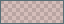
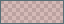

# Obsidian

## Scope

The Obsidian export uses the official `manifest.json` + `theme.css` structure. Note editing and reading surfaces are near-black teal ( `#000F13`); sidebars, tabs, status bars, prompts, and menus use the panel color. Images, attachments, canvases, and authored document colors are not filtered or rewritten.

Version 0.4.2 derives interaction seafoam ( `#00A591`), vivid document-backed green ( `#45D072`), bright warning yellow ( `#EBE565`), and error rose ( `#E84A5F`) from the approved terminal group. Role-specific proportional shades retain terminal-style intensity, a little darker and richer, not pale pastels. Core-backed syntax follows these signals; the four separate Solarized heritage syntax colors and neutral surfaces remain unchanged.

Text selection uses  `#00A59126` (unchanged 14.90% alpha). Error surfaces use translucent  `#E84A5F26`, or  `#E84A5F2E` on hover, to preserve warm text readability instead of placing it on opaque rose. HSL/RGB aliases are generated from the canonical colors.

## Install

1. Copy this `obsidian` folder to `<vault>\.obsidian\themes\DeepSeaFoam`.
2. Ensure the copied folder contains `manifest.json` and `theme.css`.
3. In Obsidian, open **Settings > Appearance > Themes** and select **DeepSeaFoam**.

Back up any CSS snippets that override theme variables before evaluating the result.

## Remove / restore

Select the previous theme, then remove `<vault>\.obsidian\themes\DeepSeaFoam` if desired. Vault notes and attachments are unaffected.

## Limitations

Community plugins can ship independent styles, and Obsidian's CSS variables evolve. The manifest declares the current official sample-theme minimum app version. Runtime validation with a representative vault and plugin set remains separate.
