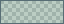
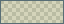
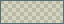

# Visual Studio Code

## Scope

`package.json` and `themes/deepseafoam-color-theme.json` form a normal VS Code color-theme extension. The editor is near-black teal ( `#000F13`) and surrounding workbench surfaces are  `#001E26`. Version 0.4.2 derives vivid seafoam ( `#00A591`), green ( `#45D072`), bright yellow ( `#EBE565`), and rose ( `#E84A5F`) directly from the approved terminal colors, shaded slightly darker and richer by role rather than softened into pale pastels. Focus, core-backed strings, keywords, numbers, and diagnostics inherit these signals. The four separate Solarized heritage syntax colors remain unchanged.

The integrated terminal shares Windows Terminal's [higher-contrast extension](https://github.com/Zanark/DeepSeaFoam/blob/main/docs/PALETTE.md#higher-contrast-terminals):  `#9CC2C3` text, rich ANSI colors, warm whites, an orange  `#F34B00` cursor and  `#003748` selection. All 19 terminal colors and its  `#000F13` background stay unchanged in 0.4.2, separate from editor text, syntax, UI selection and diagnostics.

## Readability adaptations

- UI text selection uses  `#00A59126` (unchanged 14.90% alpha); incidental selection/word highlights use  `#00A5911A` (10.20%).
- Active find fill uses  `#EBE56526`; other matches use  `#EBE5651A`, with full-color borders for distinction.
- Invalid-token errors use dark  `#000F13` text on  `#E84A5F` rose rather than warm text on the fill.

## Preview without installation

1. Open `targets\vscode` as a folder in VS Code.
2. Press `F5` to launch an Extension Development Host.
3. In that window, run **Preferences: Color Theme** and select **DeepSeaFoam**.

## Install

Install [DeepSeaFoam from the Visual Studio Marketplace](https://marketplace.visualstudio.com/items?itemName=zanark.deepseafoam-theme), then select **Preferences: Color Theme > DeepSeaFoam**. The extension ID is `zanark.deepseafoam-theme`.

For offline installation, download the VSIX from the [latest release](https://github.com/Zanark/DeepSeaFoam/releases/latest) and use **Extensions: Install from VSIX**. To build it locally, run `npm run package:release` from the repository root.

## Remove / restore

Uninstall or disable the DeepSeaFoam extension and select the previous color theme. No user settings are modified by the export itself.

## Limitations

Extensions may contribute their own colors or webviews that do not inherit every workbench token. Runtime validation in a specific VS Code build remains separate from generation and schema checks.
